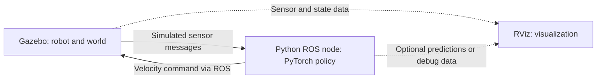

# Assess installation success

> hi importing another convo from Chat on another device and lets just pick up where we left off - we're now on the device with Arena 5 so you can inspect things directly for me!!!:
>
> okay it still looks weird but that's a problem for another day.... can you help me understand if the installation proceeded successfully? this is the end of the command output:
>
> User context
>
> Attachments:
> - # Prepare for Dr Lyu lab meeting > @Deepresearch - okay, so I have my meeting w…: `~/.codex/attachments/81f933b8-7bd0-4e3d-9932-c58e08f3db6e/Pasted text.txt`
> - See https://packaging.python.org/en/latest/guides/writing-pyproject-toml/#licen…: `~/.codex/attachments/523dade7-2025-4791-a2e9-5c7be3ef78b4/Pasted text.txt`

<details><summary>2 previous messages</summary>

> I’ll read the imported conversation and command output, then check the installation on this device.
>
> <details><summary>Explored 2 files, a search, a list, ran 2 commands</summary>
>
> - Ran `cat '/home/tahaismail/.codex/attachments/81f933b8-7bd0-4e3d-9932-c58e08f3db6e/Pasted text.txt' '/home/tahaismail/.codex/attachments/523dade7-2025-4791-a2e9-5c7be3ef78b4/Pasted text.txt'`
>
> <details><summary>Explored 2 files, a search, a list</summary>
>
> - Read `~/.codex/attachments/81f933b8-7bd0-4e3d-9932-c58e08f3db6e/Pasted text.txt`
> - Listed files in `latest_build`
> - Read `/etc/os-release`
> - Searched for `error:|CMake Error|iceoryx_hoofs` in `Pasted text.txt`
>
> </details>
>
> - Ran `cat /home/tahaismail/arena_ws/log/latest_build/iceoryx_hoofs/stderr.log; cat /home/tahaismail/arena_ws/log/latest_build/rviz_ogre_vendor/stderr.log; tail -n 35 /home/tahaismail/arena-install/install.log; dpkg-query -W -f='${Package}: ${Status}\n' libacl1-dev libxaw7-dev; rg -n 'colcon|build|set -e' /home/tahaismail/arena-install/install.sh`
>
> </details>
</details>

**Not quite—the installation stopped partway through.** I checked the actual build logs on this device:

- **200 packages built successfully.**
- **2 packages failed.**
- **156 packages were not processed.**

Both failures point to missing system development libraries:

| Failed package | Cause | Missing dependency |
|---|---|---|
| `iceoryx_hoofs` | Cannot find `sys/acl.h` | `libacl1-dev` |
| `rviz_ogre_vendor` | Cannot find the X11 Athena widget library | `libxaw7-dev` |

I also confirmed neither dependency is installed.

The repeated **license deprecation** and **`tests_require`** warnings aren’t what stopped the installation.

The next step is to install those dependencies and resume the build. **Your existing build progress is still there—you don’t need to start from scratch.** I’ve only inspected things so far; I haven’t changed the installation.

> how i do that?

<details><summary>2 previous messages</summary>

> I’ll check the installer’s build steps so I can give you the right commands to resume.
>
> <details><summary>Explored 5 files</summary>
>
> - Read `~/arena-install/install.sh`
> - Read `~/arena_ws/src/arena/arena-rosnav/tools/colcon_build`
> - Read `~/.bashrc`
> - Read `~/arena-install/install.sh`
> - Read `~/arena_ws/src/arena/arena-rosnav/tools/source.bash`
>
> </details>
</details>

Open a terminal **on this VM**, then run these two steps.

**1. Install the missing libraries:**

```bash
sudo apt-get update && sudo apt-get install -y libacl1-dev libxaw7-dev
```

**2. Once that succeeds, rerun your patched installer:**

```bash
cd "$HOME/arena-install"

export PATH="$HOME/.local/bin:$PATH"
export RCFILE="$HOME/.bashrc"
export ARENA_WS_DIR="$HOME/arena_ws"
export ARENA_BRANCH=humble
export ARENA_ROS_DISTRO=humble
export POETRY_VERSION=1.8.5

set -o pipefail
bash -i ./install.sh 2>&1 | tee "$HOME/arena-install/install-retry.log"
```

It will repeat some setup checks, but **reuse your existing workspace and build files**.

At the prompts:

- **Workspace:** press Enter to keep `/home/tahaismail/arena_ws`.
- **Delete ROS repository files:** choose **N**.
- **Gazebo:** choose **Y**.
- **Other optional simulators:** choose **N**.

The installer has additional Arena setup after the ROS build, so let it continue beyond the first build summary. If it stops again, I can inspect the new `install-retry.log` directly.

> did we get the same issue? u can inspect the log as well:
>
> Finished <<< rosidl\_runtime\_py [4.19s]
>
> Summary: 41 packages finished [36.8s]
> &#x20; 2 packages failed: iceoryx\_posh rviz\_rendering
> &#x20; 12 packages had stderr output: ament\_copyright ament\_flake8 ament\_index\_python ament\_lint ament\_pep257 ament\_xmllint iceoryx\_posh launch launch\_testing osrf\_pycommon rosidl\_runtime\_py rviz\_rendering
> &#x20; 154 packages not processed

<details><summary>2 previous messages</summary>

> I’ll check the new errors to see whether the missing libraries were resolved and what stopped this build.
>
> <details><summary>Explored 2 searches, a list, ran a command</summary>
>
> - Ran `cat /home/tahaismail/arena_ws/log/latest_build/iceoryx_posh/stderr.log /home/tahaismail/arena_ws/log/latest_build/rviz_rendering/stderr.log; tail -n 30 /home/tahaismail/arena-install/install-retry.log; dpkg-query -W -f='${Package}: ${Status}\n' libacl1-dev libxaw7-dev`
>
> <details><summary>Explored 2 searches, a list</summary>
>
> - Searched for `packages-skip|iceoryx_hoofs|rviz_ogre_vendor` in `logger_all.log`
> - Listed files in `iceoryx_hoofs`
> - Searched for `SKIP_OLD|OLD_PACKAGES|recursive_mtime` in `colcon_build`
>
> </details>
>
> </details>
</details>

**Related, but a different error—and I found why.** Both missing system libraries are now installed correctly.

Arena’s build helper mistakenly **skipped the two previously failed packages**, treating their leftover installation folders as completed builds. The new failures are downstream:

- `iceoryx_posh` cannot find `iceoryx_hoofs`.
- `rviz_rendering` cannot find `rviz_ogre_vendor`.

I missed that flaw in the helper when suggesting the retry. We can bypass it with `SKIP_OLD=0`.

Run this in your VM terminal:

```bash
cd "$HOME/arena-install"

export PATH="$HOME/.local/bin:$PATH"
export RCFILE="$HOME/.bashrc"
export ARENA_WS_DIR="$HOME/arena_ws"
export ARENA_BRANCH=humble
export ARENA_ROS_DISTRO=humble
export POETRY_VERSION=1.8.5
export SKIP_OLD=0

set -o pipefail
bash -i ./install.sh 2>&1 | tee "$HOME/arena-install/install-retry2.log"
```

Use the same prompt answers: default workspace, **N** for deleting ROS repository files, **Y** for Gazebo, **N** for other simulators.

This revisits all packages while reusing existing compiled files. **No need to delete the workspace.**

> hmm new errors:
>
> Summary: 407 packages finished [18min 26s]
> &#x20; 6 packages failed: irobot\_create\_gazebo\_plugins irobot\_create\_ignition\_toolbox irobot\_create\_nodes nav2\_map\_server turtlebot4\_ignition\_gui\_plugins turtlebot4\_ignition\_toolbox
> &#x20; 58 packages had stderr output: ament\_clang\_format ament\_clang\_tidy ament\_copyright ament\_cppcheck ament\_cpplint ament\_flake8 ament\_index\_python ament\_lint ament\_lint\_cmake ament\_mypy ament\_pep257 ament\_pycodestyle ament\_pyflakes ament\_uncrustify ament\_xmllint arena\_evaluation arena\_rclpy\_mixins behaviortree\_cpp\_v3 bondpy camera\_info\_manager\_py domain\_coordinator hunav\_agent\_manager hunav\_evaluator irobot\_create\_gazebo\_plugins irobot\_create\_ignition\_plugins irobot\_create\_ignition\_toolbox irobot\_create\_nodes launch launch\_pytest launch\_testing launch\_xml launch\_yaml nav2\_map\_server nav2\_simple\_commander opencv\_tests osrf\_pycommon plan\_msgs rl\_utils ros2bag ros2test rosidl\_runtime\_py rqt\_action rqt\_console rqt\_msg rqt\_plot rqt\_publisher rqt\_py\_console rqt\_service\_caller rqt\_shell rqt\_srv rviz\_utils sensor\_msgs\_py task\_generator\_gui testing tf2\_ros\_py turtlebot4\_ignition\_gui\_plugins turtlebot4\_ignition\_toolbox unity\_msgs
> &#x20; 39 packages not processed

<details><summary>2 previous messages</summary>

> That’s substantial progress: 407 packages finished. I’ll inspect the six failures and check whether they share missing dependencies.
>
> <details><summary>Ran 2 commands</summary>
>
> - Ran `for p in irobot_create_gazebo_plugins irobot_create_ignition_toolbox irobot_create_nodes nav2_map_server turtlebot4_ignition_gui_plugins turtlebot4_ignition_toolbox; do printf '\n%s\n' "$p"; tail -n 65 "/home/tahaismail/arena_ws/log/latest_build/$p/stderr.log"; done`
> - Ran `rg -n -C 3 'ERROR|Cannot locate|rosdep failed|unresolved|No definition' /home/tahaismail/arena-install/install-retry2.log | tail -n 100; apt-cache policy ros-humble-irobot-create-msgs ros-humble-control-msgs ros-humble-turtlebot4-msgs libgraphicsmagick++1-dev qtquickcontrols2-5-dev ros-humble-irobot-create-description; ls /opt/ros/humble/setup.bash`
>
> </details>
</details>

**The earlier blockers are cleared.** I checked the logs: these six failures come from **five more missing dependencies**.

The underlying problem is that Arena’s dependency-installation step failed on unresolved package names, then the installer continued into compilation anyway.

Run:

```bash
sudo apt-get update && sudo apt-get install -y \
  ros-humble-irobot-create-msgs \
  ros-humble-control-msgs \
  ros-humble-turtlebot4-msgs \
  libgraphicsmagick++1-dev \
  qtquickcontrols2-5-dev
```

These provide the missing robot messages, GraphicsMagick C++ headers, and Qt controls reported in the errors.

**After that succeeds**, rerun with the skip workaround still enabled:

```bash
cd "$HOME/arena-install"

export PATH="$HOME/.local/bin:$PATH"
export RCFILE="$HOME/.bashrc"
export ARENA_WS_DIR="$HOME/arena_ws"
export ARENA_BRANCH=humble
export ARENA_ROS_DISTRO=humble
export POETRY_VERSION=1.8.5
export SKIP_OLD=0

set -o pipefail
bash -i ./install.sh 2>&1 | tee "$HOME/arena-install/install-retry3.log"
```

Same prompt answers as before. Your compiled files remain reusable. These commands address all six **currently reported** failures; packages that haven’t built yet could reveal further missing dependencies.

> think we got a liiiitle closer lol:
>
> Failed   <<< nav2\_system\_tests [11.0s, exited with code 1]
> Finished <<< jackal\_navigation [16.5s]
>
> Summary: 447 packages finished [23min 2s]
> &#x20; 3 packages failed: nav2\_route nav2\_system\_tests turtlebot4\_ignition\_gui\_plugins
> &#x20; 55 packages had stderr output: ament\_clang\_format ament\_clang\_tidy ament\_copyright ament\_cppcheck ament\_cpplint ament\_flake8 ament\_index\_python ament\_lint ament\_lint\_cmake ament\_mypy ament\_pep257 ament\_pycodestyle ament\_pyflakes ament\_uncrustify ament\_xmllint arena\_bringup arena\_evaluation arena\_rclpy\_mixins arena\_simulation\_setup bondpy camera\_info\_manager\_py domain\_coordinator hunav\_evaluator irobot\_create\_gazebo\_bringup irobot\_create\_gazebo\_plugins irobot\_create\_ignition\_bringup irobot\_create\_ignition\_toolbox launch launch\_pytest launch\_testing launch\_xml launch\_yaml nav2\_route nav2\_simple\_commander nav2\_system\_tests opencv\_tests osrf\_pycommon rl\_utils ros2bag ros2test rosidl\_runtime\_py rqt\_action rqt\_console rqt\_msg rqt\_plot rqt\_publisher rqt\_py\_console rqt\_service\_caller rqt\_shell rqt\_srv rviz\_utils sensor\_msgs\_py testing tf2\_ros\_py turtlebot4\_ignition\_gui\_plugins
> &#x20; 2 packages not processed

<details><summary>2 previous messages</summary>

> Definitely closer—447 packages finished, with only two left unprocessed. I’ll inspect the remaining errors and check for any other missing dependencies before the next retry.
>
> <details><summary>Ran 3 commands</summary>
>
> - Ran `for p in nav2_route nav2_system_tests turtlebot4_ignition_gui_plugins; do printf '\n%s\n' "$p"; cat "/home/tahaismail/arena_ws/log/latest_build/$p/stderr.log"; done`
> - Ran `apt-cache policy libnanoflann-dev ros-humble-gazebo-ros-pkgs libignition-gui6-dev; rg --files /home/tahaismail/arena_ws/src | rg '/(nav2_route|nav2_system_tests|Turtlebot4Hmi)/(CMakeLists.txt|package.xml)$'; /usr/bin/rosdep check --from-paths /home/tahaismail/arena_ws/src --ignore-src --rosdistro humble --skip-keys 'ament_python ${PROJECT_NAME}_msgs rti-connext-dds-6.0.1'`
> - Ran `cat /home/tahaismail/arena_ws/src/deps/nav2/navigation2/nav2_route/CMakeLists.txt /home/tahaismail/arena_ws/src/deps/nav2/navigation2/nav2_system_tests/CMakeLists.txt /home/tahaismail/arena_ws/src/gazebo/turtlebot4_simulator/turtlebot4_ignition_gui_plugins/Turtlebot4Hmi/CMakeLists.txt`
>
> </details>
</details>

Yep 😄 **447 packages built, and the remaining three errors are missing dependencies:**

| Failed package | Missing dependency |
|---|---|
| `nav2_route` | `libnanoflann-dev` |
| `nav2_system_tests` | `ros-humble-gazebo-ros-pkgs` |
| `turtlebot4_ignition_gui_plugins` | `libignition-gui6-dev` |

I also checked dependencies across the workspace: more runtime dependencies are still missing. **Let’s finish that dependency step before another lengthy build.**

Run:

```bash
cd "$HOME/arena_ws"
sudo apt-get update

/usr/bin/rosdep install \
  --from-paths src \
  --ignore-src \
  --rosdistro humble \
  --skip-keys 'ament_python ${PROJECT_NAME}_msgs rti-connext-dds-6.0.1' \
  -r -y
```

This bypasses the two unresolved dependency names that stopped the installer earlier, plus the optional RTI middleware package—your environment uses Fast DDS. It includes the three dependencies listed above.

**If that finishes successfully**, rerun the installer:

```bash
cd "$HOME/arena-install"

export PATH="$HOME/.local/bin:$PATH"
export RCFILE="$HOME/.bashrc"
export ARENA_WS_DIR="$HOME/arena_ws"
export ARENA_BRANCH=humble
export ARENA_ROS_DISTRO=humble
export POETRY_VERSION=1.8.5
export SKIP_OLD=0

set -o pipefail
bash -i ./install.sh 2>&1 | tee "$HOME/arena-install/install-retry4.log"
```

Same prompt answers as before. If `rosdep` reports installation failures, send that output before starting the build so we can address them first.

> almost there....
>
> Summary: 449 packages finished [12min 21s]
> &#x20; 1 package failed: turtlebot4\_ignition\_gui\_plugins
> &#x20; 49 packages had stderr output: ament\_clang\_format ament\_clang\_tidy ament\_copyright ament\_cppcheck ament\_cpplint ament\_flake8 ament\_index\_python ament\_lint ament\_lint\_cmake ament\_mypy ament\_pep257 ament\_pycodestyle ament\_pyflakes ament\_uncrustify ament\_xmllint arena\_bringup arena\_evaluation arena\_rclpy\_mixins arena\_simulation\_setup bondpy camera\_info\_manager\_py domain\_coordinator hunav\_evaluator launch launch\_pytest launch\_testing launch\_xml launch\_yaml nav2\_simple\_commander opencv\_tests osrf\_pycommon rl\_utils ros2bag ros2test rosidl\_runtime\_py rqt\_action rqt\_console rqt\_msg rqt\_plot rqt\_publisher rqt\_py\_console rqt\_service\_caller rqt\_shell rqt\_srv rviz\_utils sensor\_msgs\_py testing tf2\_ros\_py turtlebot4\_ignition\_gui\_plugins
> &#x20; 2 packages not processed

<details><summary>2 previous messages</summary>

> I’ll inspect that last failure and see whether we can retry just that package first.
>
> <details><summary>Explored 3 files, a search, a list, ran a command</summary>
>
> <details><summary>Explored 3 files, a search, a list</summary>
>
> - Read `~/arena_ws/log/latest_build/turtlebot4_ignition_gui_plugins/stderr.log`
> - Listed files in `include`
> - Searched for `SuppressWarning.hh|ignition-(plugin|utils).*cmake`
> - Read `~/arena_ws/build/turtlebot4_ignition_gui_plugins/Turtlebot4Hmi/CMakeFiles/Turtlebot4Hmi.dir/flags.make`
> - Read `~/arena_ws/src/gazebo/turtlebot4_simulator/turtlebot4_ignition_gui_plugins/CMakeLists.txt`
>
> </details>
>
> - Ran `ls /home/tahaismail/arena_ws/install/ignition_cmake2_vendor/include/ignition/cmake2; printf '#include <gz/utilities/SuppressWarning.hh>\n' | /usr/bin/c++ -x c++ -E -I/usr/include/ignition/cmake2 -o /dev/null -; rg -n 'IGNITION-CMAKE.*INCLUDE|INTERFACE_INCLUDE_DIRECTORIES' /usr/lib/x86_64-linux-gnu/cmake/ignition-plugin1/ignition-plugin1-targets.cmake`
>
> </details>
</details>

**This one is a header-path mismatch, rather than another missing package.**

The missing file, `gz/utilities/SuppressWarning.hh`, **already exists on your system**. But the compiler is searching Arena’s older bundled Ignition headers instead. I verified the system header can be found with the correct include path.

First, try rebuilding **only the failed package**:

```bash
cd "$HOME/arena_ws"
export PATH="$HOME/.local/bin:$PATH"
export CPLUS_INCLUDE_PATH="/usr/include/ignition/cmake2${CPLUS_INCLUDE_PATH:+:$CPLUS_INCLUDE_PATH}"

source src/arena/arena-rosnav/tools/source.bash

colcon build \
  --symlink-install \
  --packages-select turtlebot4_ignition_gui_plugins \
  --cmake-args -DBUILD_TESTING=OFF
```

If that succeeds, **in the same terminal**, resume the installer to finish the remaining packages and setup:

```bash
cd "$HOME/arena-install"

export RCFILE="$HOME/.bashrc"
export ARENA_WS_DIR="$HOME/arena_ws"
export ARENA_BRANCH=humble
export ARENA_ROS_DISTRO=humble
export POETRY_VERSION=1.8.5
export SKIP_OLD=0

set -o pipefail
bash -i ./install.sh 2>&1 | tee "$HOME/arena-install/install-retry5.log"
```

This include-path adjustment applies only to this terminal and processes launched from it. If the single-package build fails, stop there so we can inspect that error without another full retry.

> Summary: 452 packages finished [9min 57s]
> &#x20; 1 package failed: nav2\_system\_tests
> &#x20; 50 packages had stderr output: ament\_clang\_format ament\_clang\_tidy ament\_copyright ament\_cppcheck ament\_cpplint ament\_flake8 ament\_index\_python ament\_lint ament\_lint\_cmake ament\_mypy ament\_pep257 ament\_pycodestyle ament\_pyflakes ament\_uncrustify ament\_xmllint arena\_bringup arena\_evaluation arena\_rclpy\_mixins arena\_simulation\_setup bondpy camera\_info\_manager\_py domain\_coordinator gz\_usd0 hunav\_evaluator launch launch\_pytest launch\_testing launch\_xml launch\_yaml nav2\_simple\_commander nav2\_system\_tests opencv\_tests osrf\_pycommon rl\_utils ros2bag ros2test rosidl\_runtime\_py rqt\_action rqt\_console rqt\_msg rqt\_plot rqt\_publisher rqt\_py\_console rqt\_service\_caller rqt\_shell rqt\_srv rviz\_utils sensor\_msgs\_py testing tf2\_ros\_py

<details><summary>2 previous messages</summary>

> I’ll check why `nav2_system_tests` failed this time and how far the installer got.
>
> <details><summary>Explored 4 files, ran a command</summary>
>
> <details><summary>Explored 4 files</summary>
>
> - Read `~/arena_ws/log/latest_build/nav2_system_tests/stderr.log`
> - Read `~/arena-install/install-retry5.log`
> - Read `~/arena_ws/src/arena/arena-rosnav/.installed`
> - Read `~/arena-install/install.sh`
>
> </details>
>
> - Ran `dpkg-query -W -f='${Package}: ${Status}\n' ros-humble-gazebo-ros-pkgs; rg -n 'gazebo-ros-pkgs|REMOVED|Removing|gz-harmonic|gazebo.sh|Do you want|installation finished' /home/tahaismail/arena-install/install-retry5.log | tail -n 45; cat /home/tahaismail/arena_ws/src/arena/arena-rosnav/installers/*gazebo*`
>
> </details>
</details>

**Found it: installing Gazebo Harmonic removed the older Gazebo Classic packages.** The log explicitly shows `ros-humble-gazebo-ros-pkgs` being removed.

`nav2_system_tests` requires that older package—even with tests disabled. **Don’t reinstall it:** that could conflict with the Harmonic installation we just completed.

For your Harmonic setup, exclude this Nav2 test-suite package:

```bash
touch "$HOME/arena_ws/src/deps/nav2/navigation2/nav2_system_tests/COLCON_IGNORE"
```

Then resume the installer:

```bash
cd "$HOME/arena-install"

export PATH="$HOME/.local/bin:$PATH"
export RCFILE="$HOME/.bashrc"
export ARENA_WS_DIR="$HOME/arena_ws"
export ARENA_BRANCH=humble
export ARENA_ROS_DISTRO=humble
export POETRY_VERSION=1.8.5
export SKIP_OLD=0
export CPLUS_INCLUDE_PATH="/usr/include/ignition/cmake2${CPLUS_INCLUDE_PATH:+:$CPLUS_INCLUDE_PATH}"

set -o pipefail
bash -i ./install.sh 2>&1 | tee "$HOME/arena-install/install-retry6.log"
```

Choose **Y for Gazebo** again if prompted: its completion marker wasn’t saved because the subsequent build failed. Other optional simulators stay **N**.

This excludes the test suite, not Nav2’s navigation components. The installer still needs to reach **`installation finished`**, followed by a simulation launch check before we call it fully working.

> awesome! i saw "installation finished" at the end - when it asked me to install planners.sh though I said no cuz i twas 2 am and i wanted to turn off the vm and go to sleep... should I have installed that? if so we can do that, but i also am rly unfamiliar with how the arena platform works and what I can do with it so would love to get some simulations going so I can get a feel for it

<details><summary>14 previous messages</summary>

> I’ll check what `planners.sh` adds and which planners are already available, then work toward a small simulation you can explore.
>
> <details><summary>Explored a file, a search, a list, ran 3 commands, searched the web</summary>
>
> - Ran `cat /home/tahaismail/arena_ws/src/arena/arena-rosnav/README.md; ls /home/tahaismail/arena_ws/src/arena/arena-rosnav/arena_bringup/launch; rg -n 'planner|ros2 launch|simulator' /home/tahaismail/arena_ws/src/arena/arena-rosnav/arena_bringup/launch | head -n 65; printenv DISPLAY; nvidia-smi --query-gpu=name --format=csv,noheader`
>
> - Ran `sed -n '1,145p' /home/tahaismail/arena_ws/src/arena/arena-rosnav/arena_bringup/launch/arena.launch.py; cat /home/tahaismail/arena_ws/src/arena/arena-rosnav/arena_bringup/launch/simulator/sim/gazebo/gazebo.launch.py; ls /home/tahaismail/arena_ws/src/arena; ls /dev/nvidia*; uname -r; dkms status`
>
> Searched the web for `site.arena-rosnav.readthedocs.io arena humble ros2 launch arena simulation`
>
> - Ran `nvidia-smi; lspci -nn | rg -i 'nvidia|vga|3d'; lsmod | rg nvidia; ls /lib/modules/6.8.0-1069-gcp; ls /usr/src`
>
> <details><summary>Explored a file, a search, a list</summary>
>
> - Listed files in `worlds`
> - Read `~/arena_ws/src/arena/arena-rosnav/task_generator/tasks/robots/explore.py`
> - Searched for `uv |uvx|planners.sh` in `arena-rosnav`
>
> </details>
>
> </details>
>
> Skipping `planners.sh` was fine: your copy only installs the `uv` Python tool; the default DWB and NavFn planners are already present. The L4 GPU is also working—the initial check was limited by my sandbox.
>
> I’ll try the default Jackal robot in an empty Gazebo world first. That gives us a simple way to check spawning, sensors, and navigation before adding people or more complex maps.
>
> <details><summary>Ran 5 commands, searched the web</summary>
>
> - Ran `pwd; ls /home/tahaismail/arena_ws/src/arena/arena-rosnav; cat /home/tahaismail/arena_ws/src/arena/arena-rosnav/installers/*planners*; cat /home/tahaismail/arena_ws/src/arena/arena-rosnav/.installed; rg --files -g AGENTS.md /home/tahaismail/arena_ws /home/tahaismail/Documents/ChatGPT 2>/dev/null`
>
> - Ran `rg --files /home/tahaismail/arena_ws/src/arena/arena-rosnav/task_generator | rg 'explore|rviz_ui'; rg -n 'static|dynamic|min|max' /home/tahaismail/arena_ws/src/arena/arena-rosnav/arena_bringup/configs/task*`
>
> - Ran `cat /home/tahaismail/arena_ws/src/arena/arena-rosnav/task_generator/task_generator/tasks/robots/explore.py /home/tahaismail/arena_ws/src/arena/arena-rosnav/task_generator/task_generator/tasks/modules/rviz_ui.py; cat /home/tahaismail/arena_ws/src/arena/arena-rosnav/arena_bringup/configs/task*`
>
> - Ran `ps -u tahaismail -o pid,ppid,etime,stat,args | rg 'ros2 launch|vglrun|local_setup|python.*launch|bash.*source|gazebo|gz sim' | head -n 20`
>
> - Ran `ps -u tahaismail -o pid,ppid,etime,stat,comm | tail -n 25`
>
> Searched the web for `https://arena-rosnav.readthedocs.io/en/latest/tutorials/usage/`
>
> </details>
>
> Arena has started its launch sequence and is preparing the simulation models.
>
> The main pieces are: Gazebo simulates the physical world; Arena creates robots, obstacles, pedestrians, and goals; the planners decide how the robot moves; and RViz shows the robot’s map, sensor readings, and planned paths. Your first demo uses conventional navigation, which will give you a baseline for later experiments with learned policies.
>
> <details><summary>Explored a file, 3 searches, a list, ran 4 commands</summary>
>
> - Ran `rg -n 'goalpose|Name:|Class:' /home/tahaismail/arena_ws/src/arena/arena-rosnav/arena_bringup/configs/rviz/* | tail -n 30; rg -n 'def |copy|subprocess|download' /home/tahaismail/arena_ws/src/arena/simulation-setup/arena_simulation_setup/model_staging.py`
>
> <details><summary>Explored a file, a search, a list</summary>
>
> - Listed files in `arena`
> - Searched for `(model_staging|\.rviz$|AGENTS.md$)`
> - Read `~/.ros/log/2026-09-25-16-30-33-935825-arena-dev-4030/launch.log`
>
> </details>
>
> - Ran `tail -n 20 /home/tahaismail/.gz/sim/8/server_console.log; rg -n 'Class:.*(Goal|Pose)|Topic:|Value: /goal' /home/tahaismail/arena_ws/src/arena/arena-rosnav/utils/rviz_utils/config/rviz_default.rviz; df -h /home/tahaismail/arena_ws`
>
> - Ran `ps -u tahaismail -o pid,ppid,etime,stat,comm | tail -n 30; timeout 10 gz topic -l; xwininfo -root -tree | tail -n 18`
>
> <details><summary>Explored 2 searches</summary>
>
> - Searched for `initialized|LOADING WORLD` in `task_generator`
> - Searched for `goal_pose|goalpose` in `rviz_utils`
>
> </details>
>
> - Ran `/usr/bin/python3 - <<'PY'
> import os, subprocess
> raw=open('/proc/4030/environ','rb').read().split(b'\0')
> env=dict(x.decode().split('=',1) for x in raw if b'=' in x)
> for args in [['ros2','topic','list','--no-daemon'],['ros2','node','list','--no-daemon']]:
>  r=subprocess.run(args,env=env,capture_output=True,text=True,timeout=20)
>  print(r.stdout,r.stderr)
> PY`
>
> </details>
>
> Gazebo is running and publishing its simulation clock, but the robot has not spawned yet. I’m checking that startup step before handing you a demo that only shows an empty world.
>
> <details><summary>Explored 6 files, 4 searches, 2 lists, ran 3 commands</summary>
>
> <details><summary>Explored 7 files, a search, a list</summary>
>
> - Read `~/arena_ws/src/arena/arena-rosnav/task_generator/task_generator/manager/world_manager/world_manager_ros.py`
> - Read `~/arena_ws/src/arena/arena-rosnav/task_generator/task_generator/node.py`
> - Listed files in `map_empty`
> - Read `~/arena_ws/src/arena/arena-rosnav/task_generator/task_generator/node.py`
> - Read `~/arena_ws/src/arena/arena-rosnav/task_generator/task_generator/manager/world_manager/world_manager_ros.py`
> - Read `~/arena_ws/src/arena/arena-rosnav/task_generator/task_generator/simulators/sim/gazebo_simulator.py`
> - Read `~/arena_ws/src/arena/arena-rosnav/task_generator/task_generator/node.py`
> - Read `~/arena_ws/src/arena/arena-rosnav/task_generator/task_generator/node.py`
> - Searched for `create_client|callback_group|MultiThreaded` in `arena_rclpy_mixins`
>
> </details>
>
> - Ran `/usr/bin/python3 - <<'PY'
> import subprocess
> raw=open('/proc/4030/environ','rb').read().split(b'\0'); env=dict(x.decode().split('=',1) for x in raw if b'=' in x)
> for args in [['ros2','topic','echo','/clock','--once'],['ros2','param','get','/task_generator_node','initialized'],['ros2','topic','info','/task_generator_node/map','--verbose']]:
>  print('CHECK',args,flush=True)
>  try:
>   r=subprocess.run(args,env=env,capture_output=True,text=True,timeout=12);print(r.stdout,r.stderr,flush=True)
>  except subprocess.TimeoutExpired: print('timed out',flush=True)
> PY`
>
> - Ran `cat /home/tahaismail/arena_ws/src/arena/arena-rosnav/task_generator/task_generator/__init__.py; rg -n 'Reentrant|callback_group|executor' /home/tahaismail/arena_ws/src/arena/arena-rosnav/task_generator/scripts/* /home/tahaismail/arena_ws/src/arena/arena-rosnav/utils/arena_rclpy_mixins/arena_rclpy_mixins/*`
>
> - Ran `cat /home/tahaismail/arena_ws/src/arena/arena-rosnav/task_generator/scripts/task_generator_node; rg -n 'def start|while|sleep|wait' /home/tahaismail/arena_ws/src/arena/arena-rosnav/task_generator/task_generator/manager/world_manager/world_manager_ros.py /home/tahaismail/arena_ws/src/arena/arena-rosnav/task_generator/task_generator/manager/robot_manager/robots_manager_ros.py; command -v gdb; command -v py-spy`
>
> <details><summary>Explored 5 files, 3 searches, a list</summary>
>
> - Read `~/arena_ws/src/arena/arena-rosnav/task_generator/task_generator/manager/world_manager/world_manager_ros.py`
> - Searched for `MultiThreadedExecutor|ReentrantCallbackGroup` in `task_generator`
> - Read `~/arena_ws/src/arena/arena-rosnav/task_generator/setup.py`
> - Listed files in `arena_ws`
> - Searched for `AGENTS.md$`
> - Searched for `\.sync\(` in `task_generator`
> - Read `~/arena_ws/src/arena/arena-rosnav/task_generator/task_generator/task_generator_node.py`
> - Read `~/arena_ws/src/arena/arena-rosnav/task_generator/task_generator/manager/world_manager/world_manager_ros.py`
> - Read `~/arena_ws/src/arena/arena-rosnav/utils/arena_rclpy_mixins/arena_rclpy_mixins/__init__.py`
>
> </details>
>
> </details>
>
> I found a likely startup deadlock: the task generator waits for the map while occupying the same callback group that needs to receive it. I’ll make a small, backed-up fix to let map updates run independently, then retry the demo. This is a runtime issue that the successful build would not catch.
>
> <details><summary>Explored 2 files, 3 searches, ran 3 commands</summary>
>
> - Ran `/usr/bin/python3 - <<'PY'
> from pathlib import Path
> import shutil,os,signal
> p=Path('/home/tahaismail/arena_ws/src/arena/arena-rosnav/task_generator/task_generator/manager/world_manager/world_manager_ros.py')
> old="""            self._map_callback,
>             1,
>         )"""
> new="""            self._map_callback,
>             1,
>             callback_group=rclpy.callback_groups.MutuallyExclusiveCallbackGroup(),
>         )"""
> s=p.read_text()
> assert s.count(old)==1
> backup=p.with_suffix('.py.before-map-callback-fix')
> if not backup.exists(): shutil.copy2(p,backup)
> p.write_text(s.replace(old,new))
> os.kill(4030,signal.SIGINT)
> print('Backed up and patched map callback; requested demo shutdown.')
> PY`
>
> - Ran `export PATH="$HOME/.local/bin:$PATH"
> source src/arena/arena-rosnav/tools/source.bash
> /opt/VirtualGL/bin/vglrun -d egl0 ros2 launch arena_bringup arena.launch.py sim:=gazebo world:=map_empty robot:=jackal local_planner:=dwb global_planner:=navfn`
>
> - Ran `git -C /home/tahaismail/arena_ws/src/arena/arena-rosnav diff --stat; sed -n '145,165p' /home/tahaismail/arena_ws/src/arena/arena-rosnav/task_generator/task_generator/node.py; ls /home/tahaismail/arena_ws/src/arena/simulation-setup/configs/nav2`
>
> <details><summary>Explored 2 files, 3 searches</summary>
>
> - Read `~/.ros/log/2026-09-25-16-34-24-457504-arena-dev-5031/launch.log`
> - Searched for `ERROR|Traceback|resetting|Task Reset|initialized` in `launch.log`
> - Searched for `while|wait|create_subscription|create_timer` in `robot_manager.py`
> - Searched for `while|wait` in `robots_manager_ros.py`
> - Read `~/arena_ws/src/arena/arena-rosnav/task_generator/task_generator/manager/robot_manager/robot_manager.py`
>
> </details>
>
> </details>
>
> The fix worked: Jackal has spawned, the navigation components are active, and RViz has opened. Arena is now sending navigation goals. I’m checking that the robot’s position actually changes, then I’ll give you a short tour of the controls.
>
> <details><summary>Created a file, explored a search, a list, ran 6 commands</summary>
>
> - Ran `/usr/bin/python3 - <<'PY'
> import subprocess
> raw=open('/proc/5031/environ','rb').read().split(b'\0'); env=dict(x.decode().split('=',1) for x in raw if b'=' in x)
> code='''import rclpy,time
> from nav_msgs.msg import Odometry
> rclpy.init(); n=rclpy.create_node("arena_demo_motion_check"); samples=[]
> def cb(m):
>  p=m.pose.pose.position
>  if not samples or time.monotonic()-samples[-1][0]>3:
>   samples.append((time.monotonic(),p.x,p.y)); print((p.x,p.y),flush=True)
> n.create_subscription(Odometry,"/task_generator_node/jackal/odom",cb,10)
> end=time.monotonic()+15
> while len(samples)<2 and time.monotonic()<end: rclpy.spin_once(n,timeout_sec=1)
> n.destroy_node();rclpy.shutdown()
> '''
> r=subprocess.run(['/home/tahaismail/arena_ws/src/arena/arena-rosnav/.venv/bin/python','-c',code],env=env,capture_output=True,text=True,timeout=20);print(r.stdout,r.stderr)
> PY
> xwininfo -root -tree | rg 'Gazebo|RViz|rviz'`
>
> - Ran `rg -n 'QPushButton|setText\(|Reset|Goal|Random|Dynamic|Static' /home/tahaismail/arena_ws/src/arena/arena-rosnav/utils/rviz_utils/src/* | head -n 30; ls /home/tahaismail/arena_ws/src/arena/simulation-setup/configs/nav2/controllers`
>
> - Ran `ps -p 4274,4370,4371 -o pid,ppid,args`
>
> <details><summary>Explored a search, a list</summary>
>
> - Listed files in `arena_ws`
> - Searched for `rviz.*(cpp|ui)$`
>
> </details>
>
> - Ran `kill -TERM 4370 4371`
>
> - Ran `/usr/bin/python3 - <<'PY'
> import subprocess
> raw=open('/proc/5031/environ','rb').read().split(b'\0'); env=dict(x.decode().split('=',1) for x in raw if b'=' in x)
> for a in [['ros2','topic','echo','/task_generator_node/jackal/odom','--once','--field','pose.pose.position'],['ros2','param','get','/task_generator_node','initialized']]:
>  try:
>   r=subprocess.run(a,env=env,capture_output=True,text=True,timeout=12);print(r.stdout,r.stderr)
>  except subprocess.TimeoutExpired: print('timeout')
> PY`
>
> - Wrote `./start-arena-demo.sh` (+10 -0)
>
> - Ran `/usr/bin/python3 - <<'PY'
> import subprocess
> raw=open('/proc/5031/environ','rb').read().split(b'\0'); env=dict(x.decode().split('=',1) for x in raw if b'=' in x)
> code='''import rclpy,time
> from nav_msgs.msg import Odometry
> rclpy.init(); n=rclpy.create_node("arena_demo_motion_check"); samples=[]
> def cb(m):
>  p=m.pose.pose.position
>  if not samples or time.monotonic()-samples[-1][0]>3:
>   samples.append((time.monotonic(),p.x,p.y)); print((p.x,p.y),flush=True)
> n.create_subscription(Odometry,"/task_generator_node/jackal/odom",cb,10)
> end=time.monotonic()+12
> while len(samples)<2 and time.monotonic()<end: rclpy.spin_once(n,timeout_sec=1)
> print("samples",len(samples));n.destroy_node();rclpy.shutdown()
> '''
> r=subprocess.run(['/home/tahaismail/arena_ws/src/arena/arena-rosnav/.venv/bin/python','-c',code],env=env,capture_output=True,text=True,timeout=20);print(r.stdout,r.stderr)
> PY`
>
> </details>
>
> The robot was moving, but I found a leftover Gazebo instance from the first attempt. I’m cleaning up the duplicate and checking the demo in a single simulator so the displays and sensor data stay consistent. I’ve also saved a simple launcher for future sessions.
>
> <details><summary>Explored a search, ran 3 commands</summary>
>
> - Ran `export PATH="$HOME/.local/bin:$PATH"
> source src/arena/arena-rosnav/tools/source.bash
> unset FASTRTPS_DEFAULT_PROFILES_FILE
> /opt/VirtualGL/bin/vglrun -d egl0 ros2 launch arena_bringup arena.launch.py sim:=gazebo world:=map_empty robot:=jackal local_planner:=dwb global_planner:=navfn log_level:=info`
>
> - Ran `bash -n "/home/tahaismail/Documents/ChatGPT/Master's Research/start-arena-demo.sh"; rg --files /home/tahaismail/arena_ws/src/arena | rg -i 'panel.*cpp$|\.ui$' | head -n 15`
>
> <details><summary>Explored a search</summary>
>
> - Searched for `QPushButton|setText\(|Goal|Reset|Apply` in `task_generator_panel.cpp`
>
> </details>
>
> - Ran `/usr/bin/python3 - <<'PY'
> import subprocess
> raw=open('/proc/6373/environ','rb').read().split(b'\0'); env=dict(x.decode().split('=',1) for x in raw if b'=' in x)
> code='''import rclpy,time
> from nav_msgs.msg import Odometry
> rclpy.init(); n=rclpy.create_node("arena_demo_motion_check"); samples=[]
> def cb(m):
>  p=m.pose.pose.position
>  if not samples or time.monotonic()-samples[-1][0]>4:
>   samples.append((time.monotonic(),p.x,p.y)); print((p.x,p.y),flush=True)
> n.create_subscription(Odometry,"/task_generator_node/jackal/odom",cb,10)
> end=time.monotonic()+30
> while len(samples)<2 and time.monotonic()<end: rclpy.spin_once(n,timeout_sec=1)
> print("samples",len(samples));n.destroy_node();rclpy.shutdown()
> '''
> r=subprocess.run(['/home/tahaismail/arena_ws/src/arena/arena-rosnav/.venv/bin/python','-c',code],env=env,capture_output=True,text=True,timeout=40);print(r.stdout,r.stderr)
> PY`
>
> </details>
</details>

**Skipping `planners.sh` was fine—and your first simulation is now running!** I checked your installer: that optional script only installs `uv`, a Python tool. The default navigation planners were already available.

I launched **Jackal in Gazebo with DWB + NavFn**, opened RViz, and verified that the robot’s position changes as it moves. I also fixed a startup deadlock in Arena’s map handling, with a backup of the original file.

Here’s what you’re looking at:

| Component | What it does |
|---|---|
| **Gazebo** | The simulated physical world: robot, objects, pedestrians, sensors |
| **RViz** | The robot’s view: map, laser readings, estimated position, planned paths |
| **Arena** | Sets up worlds, spawns participants, assigns goals, and manages experiments |
| **NavFn + DWB** | Plan a route to the goal and choose nearby driving motions |

Your current robot uses **conventional navigation, not a trained neural policy**. It’s a useful baseline for your eventual learning experiments. Arena supports changing robots, worlds, planners, and task modes through its launch settings. [Usage guide](https://arena-rosnav.readthedocs.io/en/latest/tutorials/usage/)

For a first hands-on tour:

1. **Watch the robot in Gazebo**, then find it in RViz. Compare the physical obstacles with its laser readings and map.
2. **Watch its path as it moves.** The current `explore` task automatically assigns new destinations.
3. In RViz’s **Task Generator panel**, try **Reset Task** to generate another episode.
4. Look for **Number of Static Obstacles** and **Number of Dynamic Obstacles**. Those are useful next experiments: how does navigation change as the environment gets busier?

There are still runtime warnings, so this is a working introductory demo—not yet a validated research benchmark.

I saved a [reusable launcher](<./start-arena-demo.sh>). **For future sessions**, after stopping the existing simulation, run:

```bash
bash "$HOME/Documents/ChatGPT/Master's Research/start-arena-demo.sh"
```

For your research interests, the natural progression is **observe the baseline → vary pedestrian interactions → compare planners → integrate a learned policy and evaluate it on repeatable scenarios**.

> lol this is so cute - i can see the robot moving around in both RViz and Gazebo - i want to get more familiar with how all this software works, so RViz sort of shows me all the state details about the robot (lidar, control, etc) and gazebo is jsut the engine for creating the simulated environemnts? and Arena itself is just an orchestrator that contains a bunch of prebuilt gazebo environments and policies? if i had a neural policy written in pytorch for example how would it be executed? or would we have to compile it to libtorch or smthn and integrate w RViz????? confusion
>
> I htink once I figure this stuff out it would be good to use one of the prebuilt Arena environemnts where the robot simply has to navigate a crowd and compare various policies from different papers - Dr. Lyu said that should give me an idea of what I want to focus on for a research project

<details><summary>2 previous messages</summary>

> You’ve mostly got it. The key distinction is that RViz displays what’s happening; it doesn’t execute the policy. I’ll check Arena’s policy interface so I can show exactly where a PyTorch model would fit in your installation.
>
> <details><summary>Ran 2 commands, searched the web</summary>
>
> - Ran `rg --files /home/tahaismail/arena_ws/src | rg '(rosnav|drlvo|crowdnav).*(README|controller|policy|server|planner).*\.(py|cpp|md)$' | head -n 35; cat /home/tahaismail/arena_ws/src/arena/simulation-setup/configs/nav2/controllers/dwb/*; ls /home/tahaismail/arena_ws/src/planners`
>
> Searched the web for `site.docs.nav2.org tutorial python controller neural network ROS2 controller plugin ...`
>
> - Ran `cat /home/tahaismail/arena_ws/src/arena/simulation-setup/configs/nav2/controllers/crowdnav/*; rg -n 'GetCommand|action_server|uv|python' /home/tahaismail/arena_ws/src/arena/simulation-setup/configs/nav2 /home/tahaismail/arena_ws/src/arena/arena-rosnav/arena_bringup/launch/utils | head -n 35; ls /home/tahaismail/arena_ws/src/arena/simulation-setup/worlds/map_empty/scenarios`
>
> Searched the web for `https://github.com/Arena-Rosnav/rosnav-rl`
>
> </details>
</details>

**Yes—you’ve mostly got it. Your PyTorch model can stay in Python, and it wouldn’t be integrated into RViz.** The missing piece in your picture is **ROS 2**, which lets all these separate programs communicate.

Here’s how the responsibilities divide up:

| Software | Its job |
|---|---|
| **Gazebo** | Simulates physics, robot motion, collisions, and sensors such as lidar and cameras. |
| **ROS 2** | Carries messages between programs: sensor readings, goals, velocity commands, etc. |
| **Nav2** | Provides navigation machinery: planning, obstacle avoidance, recovery behaviors, and goal execution. |
| **RViz** | Visualizes selected ROS data and lets you issue commands such as navigation goals. It doesn’t calculate the robot’s behavior. |
| **Arena** | Sets up and coordinates experiments: worlds, robots, pedestrian behavior, scenarios, navigation methods, resets, and evaluation. |

So RViz shows **what the software knows or estimates**, while Gazebo shows **what is happening in the simulated world**. Those can disagree—for example, the robot’s estimated position can be wrong even though Gazebo knows its exact position.

Arena is broadly the orchestrator you described, but it also supplies experiment infrastructure. And a planner appearing in its configuration files doesn’t necessarily mean its dependencies and trained weights are installed.

**Where your neural policy would run**

Imagine you trained a policy that takes lidar readings and the relative goal position, then outputs forward speed and turning rate:



The Python program would:

1. Load the model and checkpoint once.
2. Receive the relevant ROS messages.
3. Convert those observations into the tensors the model expects.
4. Run inference.
5. Send the resulting action back through ROS.
6. Repeat as the simulated robot moves.

Conceptually, the core is still ordinary PyTorch:

```python
model.eval()

# Inside a periodic control callback:
observation = preprocess(latest_scan, robot_state, goal)

with torch.inference_mode():
    action = model(observation)

send_velocity_command(decode_action(action))
```

That’s illustrative—the real adapter must handle timing, coordinate frames, missing observations, and the model’s action limits.

**No LibTorch conversion is inherently required.** A native Nav2 controller plugin uses a C++ interface, but it can communicate with a separate Python policy process. Alternatively, a Python node can command the robot directly, with the existing controller disabled or appropriately routed so they don’t compete. [Nav2 controller interface](https://docs.nav2.org/jazzy/tutorials/plugin_tutorials/writing_new_controller_plugin/writing_new_controller_plugin/)

Arena’s associated **RosNav-RL** project already demonstrates this separation: a Python server collects observations and serves a velocity command through a ROS `GetCommand` service. Its current upstream interface would need checking against your installed Arena version before we wire it in. [RosNav-RL deployment documentation](https://github.com/Arena-Rosnav/rosnav-rl#usage)

A neural model also doesn’t have to output velocities. It could predict pedestrian trajectories or propose robot paths, with another component converting those into motion. **Where we insert the model depends on what it learns.**

**Your proposed crowd-navigation comparison is a good next experiment.** I found existing scenario files in your installation named `highly_social.json`, `blocked_corridors.json`, and `evacuation.json`. We should inspect their actual contents before choosing one.

I’d start with a small comparison:

- **One conventional baseline:** your working DWB controller.
- **One learned policy:** a published method with obtainable weights and compatible inputs.
- **One fixed scenario family:** pedestrians crossing the robot’s route, with several crowd densities.

The biggest fairness issue is **what information each policy receives**. A method given exact pedestrian positions and velocities has a different task from one receiving raw lidar. Likewise, a policy trained for a robot that can move sideways won’t transfer directly to Jackal’s forward-and-turn motion.

We’d compare completion, collisions, timeouts, travel time, clearance from people, and representative failure videos—using the same robot and scenario specifications across methods.

That gives you something concrete to discuss with Dr. Lyu: *“This policy freezes when people cross its path; this one progresses but passes too closely. What information or learning objective would improve that tradeoff?”* That’s a much stronger route toward a research question than choosing a model architecture first.

> yeah can we do a comprehensive audit on the scenarios i can choose from? I think we should keep this constant for the time being so I can learn other aspects of the Arena ecosystem more easily without worrying about the scenario or honestly even the robot changing (so we should decide a robot model up front, probably just one with simple motions like turn and accelerate or wtv)
>
> also i've made a git repo for my initial testing/simulatiosn - just FYI, dont need to put anythign in there necessarily yet: /home/tahaismail/Documents/Lyu\_Lab/initial-arena-testing

<details><summary>8 previous messages</summary>

> I’ll audit the scenarios in your installed Arena version: their maps, pedestrian behavior, robot settings, and any randomization that affects repeatability. Then I’ll recommend one fixed scenario and robot for learning the rest of the system. I’ll leave your new testing repo untouched.
>
> <details><summary>Explored 7 files, 2 searches, 2 lists, ran 3 commands</summary>
>
> <details><summary>Explored 5 files, a list</summary>
>
> - Listed files in `worlds`
> - Read `~/arena_ws/src/arena/arena-rosnav/task_generator/task_generator/tasks/robots/scenario.py`
> - Read `~/arena_ws/src/arena/arena-rosnav/task_generator/task_generator/tasks/obstacles/scenario.py`
> - Read `~/arena_ws/src/arena/simulation-setup/worlds/map_empty/scenarios/1.json`
> - Read `~/arena_ws/src/arena/simulation-setup/worlds/map_empty/scenarios/default.json`
> - Read `~/arena_ws/src/arena/simulation-setup/arena_simulation_setup/world.py`
>
> </details>
>
> - Ran `python3 - <<'PY'
> from pathlib import Path
> import json,hashlib
> root=Path('/home/tahaismail/arena_ws/src/arena/simulation-setup/worlds')
> for w in sorted(root.iterdir()):
>  if not w.is_dir():continue
>  print('\nWORLD',w.name,'map', (w/'map/map.yaml').exists(),'sdf',(w/'worlds'/f'{w.name}.world').exists())
>  for p in sorted((w/'scenarios').glob('*.json')):
>   try:
>    d=json.loads(p.read_text());o=d.get('obstacles',{});dyn=o.get('dynamic',[])
>    print(p.name,'R/S/D/I',*[len(x) for x in [d.get('robots',[]),o.get('static',[]),dyn,o.get('interactive',[])]], 'models',sorted({x.get('model','?') for x in dyn}),'hash',hashlib.sha256(json.dumps(d,sort_keys=True).encode()).hexdigest()[:8], 'route',d.get('robots',[])[:1])
>   except Exception as e: print(p.name,'ERROR',str(e))
> PY`
>
> <details><summary>Explored 2 files, 2 searches, a list</summary>
>
> - Searched for `class Obstacle|class DynamicObstacle|def parse` in `shared.py`
> - Read `~/arena_ws/src/arena/simulation-setup/worlds/map_empty/map/obstacles.yaml`
> - Read `~/arena_ws/src/arena/simulation-setup/entities/robots/jackal/model_params.yaml`
> - Listed files in `robots`
> - Searched for `random|waypoint_mode|max_vel|behavior` in `hunav.py`
>
> </details>
>
> - Ran `python3 - <<'PY'
> import yaml,PIL,matplotlib
> print('available')
> PY
> cat /home/tahaismail/arena_ws/src/arena/simulation-setup/worlds/hospital/scenarios/default.json | head -n 65; cat /home/tahaismail/arena_ws/src/arena/simulation-setup/worlds/map_empty/scenarios/blocked_corridors.json | head -n 45; rg -n 'waypoint_mode|class Hunav|vmax|random|velocity|max_vel' /home/tahaismail/arena_ws/src/arena/arena-rosnav/task_generator/task_generator/simulators/human/hunav/*.py | tail -n 35`
>
> - Ran `cat /home/tahaismail/arena_ws/src/arena/arena-rosnav/task_generator/task_generator/simulators/human/hunav/__init__.py | sed -n '100,150p;225,252p'; rg -n 'HunavDynamicObstacle|desired_velocity|from_yaml|parse' /home/tahaismail/arena_ws/src/arena/arena-rosnav/task_generator/task_generator/simulators/human/hunav/hunav.py | tail -n 22; cat /home/tahaismail/arena_ws/src/arena/simulation-setup/entities/obstacles/dynamic/gazebo_actor/*yaml; cat /home/tahaismail/arena_ws/src/arena/simulation-setup/worlds/{map_empty,generated,house17,factory,hospital,ignc}/map/map.yaml; sed -n '1,100p' /home/tahaismail/arena_ws/src/arena/simulation-setup/arena_simulation_setup/__init__.py`
>
> </details>
>
> The catalog has some important wrinkles: several files are duplicates, some use older scenario formats, and `highly_social.json` gives the robot a goal outside the `map_empty` map. Also, “empty” describes the world name, not necessarily its contents—it has a world-level shelf.
>
> Jackal still looks like the right robot to keep. Its normal commands are forward speed and turning rate, so there’s no steering-wheel or sideways-motion interface to learn.
>
> <details><summary>Ran 2 commands</summary>
>
> - Ran `sed -n '190,225p' /home/tahaismail/arena_ws/src/arena/arena-rosnav/task_generator/task_generator/simulators/human/hunav/__init__.py; rg --files /home/tahaismail/arena_ws/src/arena/simulation-setup/entities | rg 'actor1|gazebo_actor' | head -n 15; rg -n 'cyclic_goals|desired_velocity|max_vel|goal_radius' /home/tahaismail/arena_ws/src/arena/arena-rosnav/arena_bringup/configs/hunav* -g '*.yaml'; rg -n 'namespace|scenario' /home/tahaismail/arena_ws/src/arena/arena-rosnav/task_generator/task_generator/tasks/{robots,obstacles}/__init__.py; cat /home/tahaismail/arena_ws/src/arena/simulation-setup/worlds/map_empty/scenarios/evacuation.json | head -n 50`
> - Ran ``mkdir -p arena-scenario-audit
> cat > arena-scenario-audit/audit.py <<'PY'
> from pathlib import Path
> import json, hashlib, math, os
> os.environ['MPLCONFIGDIR']='/tmp/arena-audit-mpl'
> import yaml, numpy as np
> from PIL import Image
> import matplotlib
> matplotlib.use('Agg')
> import matplotlib.pyplot as plt
> ROOT=Path('/home/tahaismail/arena_ws/src/arena/simulation-setup')
> OUT=Path(__file__).resolve().parent
> rows=[]; maps={}; seen={}
> for w in sorted((ROOT/'worlds').iterdir()):
>  if not w.is_dir() or w.name=='.old': continue
>  yp=w/'map/map.yaml'
>  if not yp.exists(): continue
>  m=yaml.safe_load(yp.read_text()); ip=yp.parent/m['image']; a=np.array(Image.open(ip).convert('L')); h,ww=a.shape; res=m['resolution']; ox,oy,yaw=m['origin']; maps[w.name]=(m,a)
>  def state(p):
>   x,y=p[:2]; c=math.floor((x-ox)/res); r=h-1-math.floor((y-oy)/res)
>   if not(0<=c<ww and 0<=r<h):return 'outside'
>   occ=(a[r,c]/255 if m.get('negate',0) else 1-a[r,c]/255)
>   return 'occupied' if occ>m['occupied_thresh'] else 'unknown' if occ>=m['free_thresh'] else 'free'
>  for p in sorted((w/'scenarios').glob('*.json')):
>   d=json.loads(p.read_text()); obs=d.get('obstacles',{}); dyn=obs.get('dynamic',[]); static=obs.get('static',[])+obs.get('interactive',[]); robots=d.get('robots',[])
>   flags=[]; issues=[]
>   for i,r in enumerate(robots):
>    for k in ['start','goal']:
>     st=state(r[k]);
>     if st!='free':issues.append(f'robot {i+1} {k}: {st}')
>   for kind,items in [('pedestrian',dyn),('static',static)]:
>    for i,o in enumerate(items):
>     model=o.get('model','')
>     if not model:issues.append(f'{kind} {i+1}: missing model')
>     elif not any((ROOT/'entities/obstacles'/t/model).exists() for t in ['static','dynamic','interactive']):issues.append(f'{kind} {i+1}: unavailable model {model}')
>     if 'pos' in o:
>      st=state(o['pos'])
>      if st!='free':issues.append(f'{kind} {i+1} start: {st}')
>     if kind=='pedestrian':
>      if not o.get('waypoints'):issues.append(f'pedestrian {i+1}: no waypoints')
>      if len(o.get('waypoints',[]))!=len({tuple(v) for v in o.get('waypoints',[])}):issues.append(f'pedestrian {i+1}: repeated waypoints')
>      for j,pt in enumerate(o.get('waypoints',[])):
>       st=state(pt)
>       if st!='free':issues.append(f'pedestrian {i+1} waypoint {j+1}: {st}')
>   digest=hashlib.sha256(json.dumps(d,sort_keys=True).encode()).hexdigest(); duplicate=seen.get(digest);seen.setdefault(digest,f'{w.name}/{p.name}')
>   worldobs=w/'map/obstacles.yaml'; wo=yaml.safe_load(worldobs.read_text()) if worldobs.exists() else {}
>   rows.append(dict(world=w.name,file=p.name,robots=len(robots),static=len(static),pedestrians=len(dyn),world_static=len((wo or {}).get('static',[])),robot_routes=robots,models=sorted({o.get('model','MISSING') for o in dyn}),issues=issues,duplicate_of=duplicate,sha256=digest,path=str(p),map_bounds=[ox,oy,ox+ww*res,oy+h*res],sdf=(w/'worlds'/f'{w.name}.world').exists()))
> (OUT/'inventory.json').write_text(json.dumps(rows,indent=2))
> lines=['# Installed Arena scenario audit','', 'Scope: local scenario files and loader code, 2026-09-25. Static audit, not a runtime certification. No changes to scenarios, robots, or the testing repository.','',f'{len(rows)} JSON files; {len(seen)} distinct normalized JSON payloads. Duplicate scenario content does not imply duplicate environments.','', 'Counts exclude world geometry; world-level static objects are shown separately. Pixel checks use each map YAML image, origin, resolution, negate and thresholds. They test point centers only, not robot clearance, path feasibility, mesh alignment or timing.','', '| World / scenario | Robots | Scenario static | Pedestrians | World static | Findings |','|---|---:|---:|---:|---:|---|']
> for r in rows:
>  findings=[]
>  if r['duplicate_of']:findings.append('same JSON as '+r['duplicate_of'])
>  if not r['robots']:findings.append('no robot route')
>  findings.extend(r['issues'])
>  lines.append(f"| {r['world']}/{r['file']} | {r['robots']} | {r['static']} | {r['pedestrians']} | {r['world_static']} | {'; '.join(findings) or 'No point/model flags; runtime validation still required'} |")
> lines+=['','## World geometry','', '| World | Map extent (metres) | Matching .world file |','|---|---|---|']
> for name,(m,a) in maps.items():
>  h,w=a.shape;ox,oy,_=m['origin'];s=m['resolution']; lines.append(f'| {name} | x {ox:g} to {ox+w*s:g}; y {oy:g} to {oy+h*s:g} | {"yes" if (ROOT/"worlds"/name/"worlds"/f"{name}.world").exists() else "no: Gazebo launch uses empty.sdf fallback"} |')
> lines+=['','## Complete per-file details','']
> for r in rows:
>  lines += [f"### {r['world']}/{r['file']}",'',f"Source: [{r['file']}]({r['path']})",'',f"Pedestrian models: {', '.join(r['models']) or 'none'}.",f"Robot routes: `{json.dumps(r['robot_routes'])}`",'', '\n'.join('- '+v for v in r['issues']) or 'No point/model flags.', '']
> (OUT/'audit.md').write_text('\n'.join(lines))
> # Atlas: occupancy maps plus routes. Lines connect waypoints, not predicted trajectories.
> fig,axs=plt.subplots(2,3,figsize=(16,10))
> for ax,name in zip(axs.flat,['map_empty','generated','house17','factory','hospital','ignc']):
>  m,a=maps[name];h,w=a.shape;ox,oy,_=m['origin'];s=m['resolution'];ax.imshow(a,cmap='gray',vmin=0,vmax=255,extent=[ox,ox+w*s,oy,oy+h*s],origin='upper');ax.set_title(name);ax.set_xlabel('x (m)');ax.set_ylabel('y (m)')
> fig.suptitle('Installed world occupancy maps — not Gazebo screenshots',fontsize=17);fig.tight_layout();fig.savefig(OUT/'world-atlas.png',dpi=150);plt.close(fig)
> fig,axs=plt.subplots(2,3,figsize=(16,10))
> for ax,f in zip(axs.flat,['1.json','2.json','3.json','4.json','5.json','evacuation.json']):
>  m,a=maps['map_empty'];h,w=a.shape;s=m['resolution'];ax.imshow(a,cmap='gray',vmin=0,vmax=255,extent=[0,w*s,0,h*s],origin='upper')
>  d=json.loads((ROOT/'worlds/map_empty/scenarios'/f).read_text());r=d['robots'][0]; ax.plot(*zip(r['start'][:2],r['goal'][:2]),'--',color='#2765c2',lw=1);ax.scatter(*r['start'][:2],c='#2765c2',marker='o',s=65);ax.scatter(*r['goal'][:2],c='#2765c2',marker='*',s=130)
>  for o in d['obstacles']['dynamic']:
>   pts=[o['pos']]+o.get('waypoints',[]);ax.plot([p[0] for p in pts],[p[1] for p in pts],color='#cf5c32',alpha=.6,lw=1);ax.scatter(*o['pos'][:2],color='#cf5c32',s=20)
>  for o in d['obstacles']['static']:ax.scatter(*o['pos'][:2],c='#663399',marker='s',s=45)
>  ax.scatter(5,5,c='black',marker='s',s=45);ax.set_title(f);ax.set_xlim(-1,33);ax.set_ylim(-1,26);ax.set_aspect('equal')
> fig.suptitle('map_empty candidates: blue robot endpoints; orange pedestrian waypoint links\npurple scenario objects; black world shelf. Lines are NOT planned paths.',fontsize=14);fig.tight_layout();fig.savefig(OUT/'scenario-atlas.png',dpi=150);plt.close(fig)
> print('files',len(rows),'unique',len(seen))
> for r in rows:
>  print(r['world']+'/'+r['file'], '; '.join(r['issues']) or 'no point/model flags')
> PY
> python3 arena-scenario-audit/audit.py``
>
> </details>
>
> Viewed 2 images
>
> <details><summary>Ran 2 commands</summary>
>
> - Ran `rg -n -A 65 'def model_parse|class ModelLoader|def load' /home/tahaismail/arena_ws/src/arena/simulation-setup/arena_simulation_setup/utils/models/*py | head -n 95; cat /home/tahaismail/arena_ws/src/arena/arena-rosnav/arena_bringup/configs/hunav_agents/default.yaml | head -n 42; cat /home/tahaismail/arena_ws/src/arena/arena-rosnav/task_generator/task_generator/tasks/robots/__init__.py | head -n 75; cat /home/tahaismail/arena_ws/src/arena/arena-rosnav/task_generator/task_generator/tasks/obstacles/__init__.py | head -n 70; git -C /home/tahaismail/arena_ws/src/arena/simulation-setup rev-parse HEAD`
> - Ran `rg -n -A 40 'class TaskMode' /home/tahaismail/arena_ws/src/arena/arena-rosnav/task_generator/task_generator/tasks/__init__.py; rg -n 'scenario|namespace' /home/tahaismail/arena_ws/src/arena/arena-rosnav/task_generator/task_generator/tasks/task_factory.py; rg -n 'max_vel|footprint|robot_radius|velocity_smoother' /home/tahaismail/arena_ws/src/arena/simulation-setup/configs/nav2/nav2.yaml | head -n 22; git -C /home/tahaismail/arena_ws/src/arena/simulation-setup status --short; sed -n '395,414p' /home/tahaismail/arena_ws/src/arena/arena-rosnav/task_generator/task_generator/simulators/human/hunav/hunav.py; rg -n 'urdf|model|ros__parameters' /home/tahaismail/arena_ws/src/arena/arena-rosnav/arena_bringup/launch/arena.launch.py | tail -n 10`
>
> </details>
>
> The audit covers 40 scenario files, including the generated placeholder, with 26 distinct JSON definitions. My strongest starter candidate is **Jackal + `map_empty/5.json`**: one robot, three pedestrians, fixed start and goal, and five scenario shelves plus the world’s existing shelf. Its listed positions and waypoints pass the map-point checks.
>
> The 10-person `evacuation.json` is a denser option, but its many waypoint loops would make behavior harder to interpret at first. I also checked the pedestrian loader: it uses HuNav defaults, so a scenario file alone doesn’t fully specify crowd behavior. We should hold those settings fixed too.
>
> <details><summary>Ran 2 commands</summary>
>
> - Ran ``cat > arena-scenario-audit/recommendation.md <<'EOF'
> # Recommended fixed Arena learning setup
>
> Audit date: 2026-09-25. Asset repository HEAD: `3f142b25d88ce962c803b57cf20f38985d376dea`. The asset repository had no tracked modifications at audit time.
>
> ## Decision
>
> Keep one Jackal. Use `map_empty/scenarios/5.json` as the proposed fixed introductory scenario. Keep Gazebo Harmonic, HuNav, NavFn and DWB initially. This is a recommendation based on a static audit; the exact scenario has not yet been launched and validated. The previous moving demo used explore/random modes, not this fixed scenario.
>
> - Robot start: (25.3, 1.25), yaw 0.7 radians.
> - Robot goal: (6.0, 21.8), yaw 0 radians.
> - 3 pedestrian definitions, 5 scenario shelves, plus 1 world shelf at (5,5), plus boundary walls.
> - Robot and pedestrian point positions pass the map occupancy checks. This does not establish footprint clearance, collision-free pedestrian routes, or repeatability.
> - The scenario is sparse interaction rather than a dense crowd. It is suitable for learning the stack before selecting a final research benchmark.
>
> ## How the fixed setup differs from the current demo
>
> Set `tm_robots:=scenario` and `tm_obstacles:=scenario`; the shared scenario selector is ROS parameter `task.scenario.file`, to be set to `5.json` in the task-generator configuration. It is not a declared top-level launch argument in the inspected launch file. Keep the original scenario file intact and use an explicit run configuration when this setup is activated. Do not assume adding `scenario:=5.json` to the launch command selects it.
>
> Freeze robot model, start and goal, scenario content/hash, world content, pedestrian simulator and behavior settings, simulation settings, policy observation interface, velocity/acceleration bounds, episode timeout and success thresholds. A fixed scenario specifies initial conditions and pedestrian intentions; reactive pedestrians can take different trajectories in response to different robot policies. Timing/physics can also vary across repeated runs. Fixed files do not imply bitwise-deterministic simulations.
>
> ## Robot
>
> Jackal is already demonstrated moving in this installation. Its model declares `is_holonomic: false`; use forward velocity v and yaw rate omega. It can turn in place, unlike a car-like steering model. Policies normally request speed, not acceleration directly; controller settings constrain acceleration.
>
> The DWB configuration currently specifies max forward speed 0.26 m/s, max yaw rate 1 rad/s and acceleration limits 2.5 m/s^2 (x), 3.2 rad/s^2 (yaw). The Jackal model's generic learned-policy action ranges instead specify linear [-2,2] and angular [-4,4]. These are different configurations, not a single verified effective limit. Use the same effective bounds when comparing policies.
>
> Footprint caveat: Jackal model parameters declare robot_radius=0.267 m but also a navigation footprint of +/-0.1 m in each axis. The footprint and Gazebo collision geometry must be reconciled before treating clearance/collision comparisons as research evidence. Keep the model fixed now; validate this configuration before benchmarking.
>
> ## Pedestrian semantics
>
> The installed HuNav conversion reads default agent1 from `arena_bringup/configs/hunav_agents/default.yaml` when per-person settings are absent: desired speed 0.3 m/s, radius 0.4 m, cyclic_goals=true, goal_radius=0.3 m. It reads `desired_velocity`, `cyclic_goals` and optional `behavior` from scenario extras. The legacy `waypoint_mode` field is not used in the inspected HuNav conversion; do not infer behavior from that numeric field. Agent IDs are reassigned during spawning, so repeated `id: 0` values in legacy JSON are not automatically an ID collision at runtime.
>
> Default agent1 behavior is regular; its YAML social_force_factor is 0 and the bridge hardcodes goal_force_factor=20. These deserve runtime verification before describing a benchmark as socially realistic. File names such as highly_social or evacuation do not establish behavioral fidelity. The evacuation JSON contains long looping waypoint sequences rather than evidence of a validated emergency-evacuation model.
>
> ## Catalog summary
>
> - `map_empty`: 11 files. Best starter world; established basic Gazebo launch. `1.json` has a repeated pedestrian waypoint. `2.json` through `5.json` are plausible fixed candidates. `default.json` differs from `5.json` (0 scenario shelves instead of 5, and actor1 instead of gazebo_actor). `evacuation.json` has 10 pedestrians. `highly_social.json` has an out-of-map robot goal (-1,-1). `blocked_corridors.json` has missing model fields, empty pedestrian waypoint lists and out-of-map points. `marl.json` describes 21 robot routes, not 21 pedestrians, and has occupied/unknown goal points. `empty.json` is `{}` with no robot route.
> - `factory`: 4 files, 3 unique definitions. `default.json` and `scenario2.json` are identical, with 2 pedestrians and an unknown-map pedestrian waypoint. `scenario1.json` has 2 pedestrians and no point/model flags. `default1.json` has 5 and no point/model flags. Native factory world exists; meshes/plugins and navigation-map alignment remain untested.
> - `hospital`: 1 scenario, 17 pedestrians. First 4 lack model fields. Separate one/two/three-floor world files exist, but the current launcher selects the file matching `hospital.world`; these are not three separately selectable scenario definitions. Additional geometry/assets need runtime validation.
> - `house17`: 10 files. The installed occupancy map matches the simple rectangular map_empty layout, and there is no matching house17.world; Gazebo falls back to empty.sdf. The presence of map.dae alone does not make this a functioning furnished-house launch. Scenarios 1–5 mirror map_empty geometry with actor1 substitutions. default has 3 scenario shelves and no pedestrians. The same out-of-map/legacy issues affect highly_social, blocked_corridors and marl.
> - `ignc`: 2 files. default has 3 pedestrians and 3 scenario static objects, but the robot start lies in unknown map space. marl has 3 robot routes and no pedestrians. Native world exists; runtime validation needed.
> - `generated`: 11 files. Current map is 12.8 x 12.8 m while copied scenarios largely use coordinates from the larger map_empty layout. Nonempty definitions have out-of-map robot points; do not use unchanged. default duplicates 5. No matching generated.world.
> - `.generated`: 1 placeholder scenario `{}`. Special runtime generation target; not a frozen benchmark.
> - `.old`: archived directory, not exposed by the ordinary world-list loader; excluded from selectable-catalog audit.
>
> ## Audit scope and limitations
>
> See audit.md for every file, exact route, model flags and point-level issues; inventory.json contains hashes and machine-readable details. Checks covered JSON parsing, map availability, named world-file selection, direct model-directory availability, route counts, duplicated content, robot/pedestrian/static point occupancy and repeated/missing pedestrian waypoints. They did not execute every scenario, validate all mesh references, check full footprints, compare Gazebo geometry to maps, or measure pedestrian trajectories.
>
> An obstacle count in JSON excludes geometry embedded in the world file. The point checks likewise cannot see dynamically spawned shelves unless baked into the occupancy map. A no-flags result means candidate for runtime validation, not certified working.
>
> ## Source code inspected
>
> - `/home/tahaismail/arena_ws/src/arena/simulation-setup/arena_simulation_setup/world.py`
> - `/home/tahaismail/arena_ws/src/arena/simulation-setup/arena_simulation_setup/shared.py`
> - `/home/tahaismail/arena_ws/src/arena/arena-rosnav/task_generator/task_generator/tasks/robots/scenario.py`
> - `/home/tahaismail/arena_ws/src/arena/arena-rosnav/task_generator/task_generator/tasks/obstacles/scenario.py`
> - `/home/tahaismail/arena_ws/src/arena/arena-rosnav/task_generator/task_generator/tasks/task_factory.py`
> - `/home/tahaismail/arena_ws/src/arena/arena-rosnav/task_generator/task_generator/simulators/human/hunav/__init__.py`
> - `/home/tahaismail/arena_ws/src/arena/arena-rosnav/task_generator/task_generator/simulators/human/hunav/hunav.py`
> - `/home/tahaismail/arena_ws/src/arena/arena-rosnav/arena_bringup/launch/simulator/sim/gazebo/gazebo.launch.py`
> - `/home/tahaismail/arena_ws/src/arena/simulation-setup/entities/robots/jackal/model_params.yaml`
> - `/home/tahaismail/arena_ws/src/arena/simulation-setup/configs/nav2/controllers/dwb/dwb.yaml`
>
> No scenario or robot configuration was changed by this audit. `/home/tahaismail/Documents/Lyu_Lab/initial-arena-testing` was left untouched.
> EOF
> ls /home/tahaismail/arena_ws/src/arena/simulation-setup/configs/nav2/controllers/dwb
> python3 - <<'PY'
> import hashlib
> from pathlib import Path
> r=Path('/home/tahaismail/arena_ws/src/arena/simulation-setup/worlds')
> for w in ['map_empty','house17']:
>  p=r/w/'map/map.png';print(w,hashlib.sha256(p.read_bytes()).hexdigest())
> PY``
>
> - Ran `python3 - <<'PY'
> from pathlib import Path
> p=Path('arena-scenario-audit/recommendation.md');s=p.read_text().replace('controllers/dwb/dwb.yaml','controllers/dwb/controller_config.yaml');p.write_text(s)
> PY`
>
> Tool call
>
> Tool: open_in_codex
> Status: completed
>
> </details>
</details>

**My recommendation is to keep Jackal and use `map_empty/5.json` as our fixed learning scenario.** It has one robot, three pedestrians, and a manageable obstacle layout. We should validate that exact scenario once before locking it in.

I audited **40 installed scenario files, representing 26 distinct JSON definitions**, plus the map files and scenario-loading code. Several attractive-sounding options need repairs, so choosing by filename would be misleading.

The [complete audit](<./arena-scenario-audit/audit.md>) lists every file and its findings. I also saved a [recommended configuration and interpretation notes](<./arena-scenario-audit/recommendation.md>). Your new testing repo is untouched.

**First, distinguish “world” from “scenario.”**

- **World:** the physical layout and navigation map.
- **Scenario:** robot start/goal, additional objects, and pedestrian starting positions and waypoints.
- **Pedestrian simulator:** determines how people actually move and react.

Keeping only the world constant would still allow Arena’s current `explore`/`random` modes to change the task.

| Installed world | Scenario files | What the audit found |
|---|---:|---|
| **`map_empty`** | 11 | Best starting point. Simple rectangular space; includes a world-level shelf despite its name. Several usable-looking fixed scenarios. |
| **`factory`** | 4 | Three distinct definitions, with 2–5 pedestrians. A promising later option with more environmental complexity. |
| **`hospital`** | 1 | 17 pedestrians. Four lack model fields; needs compatibility checks before use. |
| **`house17`** | 10 | Its installed navigation map is identical to `map_empty`. No matching Gazebo `.world` file, so the launcher falls back to an empty world. Don’t assume this launches a furnished house. |
| **`ignc`** | 2 | One three-pedestrian scenario and one three-robot scenario. The pedestrian scenario’s robot start falls in unknown map space. |
| **`generated`** | 11 | Copied scenarios largely exceed the current map’s dimensions. Needs correction before use. |
| **`.generated`** | 1 | Empty placeholder for generated content, not a fixed benchmark. |

These are **static audit findings**, not a claim that every scenario has been successfully simulated.

**Within `map_empty`, these are your choices:**

| Scenario | Pedestrians | Added static objects* | Assessment |
|---|---:|---:|---|
| `1.json` | 3 | 3 | Simple, but one pedestrian has duplicate waypoints. |
| `2.json` | 3 | 5 | Plausible candidate; listed points pass map checks. |
| `3.json` | 3 | 6 | More obstacles along the robot’s general route. |
| `4.json` | 3 | 5 | Another plausible crossing configuration. |
| **`5.json`** | **3** | **5** | **My starter choice:** fixed diagonal journey with pedestrian crossings. |
| `default.json` | 3 | 0 | Different from `5.json`; also uses a different pedestrian model. |
| `evacuation.json` | 10 | 3 | Dense, long pedestrian waypoint loops. Useful later; the name doesn’t establish realistic evacuation behavior. |
| `highly_social.json` | 10 | 0 | Robot goal `(-1, -1)` lies outside the map. |
| `blocked_corridors.json` | 7 | 12 | Missing model fields, empty waypoint lists, and out-of-map positions. Needs repair. |
| `marl.json` | 0 | 0 | **21 robot routes**, not a pedestrian crowd; several goal positions are problematic. |
| `empty.json` | 0 | 0 | Empty definition with no robot route. |

\*Excludes boundary walls and the existing world-level shelf.

Here are the main candidates. Blue marks the robot’s start/goal; orange connects pedestrian waypoints; purple marks scenario objects. **The connecting lines are not predicted or planned trajectories.**


**For the robot, stick with Jackal.** We already have it moving, and its command interface is straightforward:

- Forward velocity \(v\): how fast to move.
- Angular velocity \(\omega\): how fast to turn.
- It can turn in place; it doesn’t move sideways.
- Acceleration is constrained by controller settings rather than normally being the policy’s direct output.

One benchmarking detail surfaced: the generic learned-policy action limits differ from DWB’s limits, and the configured navigation footprint deserves checking against the robot geometry. We should reconcile those before comparing policies, while keeping the robot model unchanged.

**The proposed fixed setup is therefore:**

| Setting | Choice |
|---|---|
| Robot | One Jackal |
| World | `map_empty` |
| Scenario | `5.json` |
| Robot journey | `(25.3, 1.25)` → `(6.0, 21.8)` |
| People | Three, with fixed initial positions and waypoint lists |
| Task modes | `scenario` for both robots and obstacles |
| Initial navigation | NavFn + DWB |
| Pedestrians | HuNav, with its behavior settings held constant |

Three pedestrians is a **sparse interaction scenario**, which suits learning the software. We can save the dense crowd for later.

“Fixed” means the same initial setup and pedestrian intentions—not necessarily identical pedestrian trajectories when different robot policies interact with them. The exact scenario still needs a launch check for spawning, clearance, and repeated resets. I haven’t changed your running demo or scenario files during this audit.

> honestly i kind of want to use hospital - i feel like the map empty world doesn't provide enough realisim or pedestrians to stress test the different models - can we try and get hospital working?

<details><summary>15 previous messages</summary>

> Yes—hospital is a better fit for the crowd stress test you have in mind. I’ll check its world assets and pedestrian definitions, fix any compatibility issues with backups, and try it with the same Jackal robot.
>
> <details><summary>Explored 4 files, a search, ran 5 commands</summary>
>
> <details><summary>Explored 4 files, a search</summary>
>
> - Read `~/arena_ws/src/arena/simulation-setup/worlds/hospital/map/map.world.yaml`
> - Read `~/arena_ws/src/arena/simulation-setup/worlds/hospital/worlds/hospital.world`
> - Read `~/arena_ws/src/arena/simulation-setup/arena_simulation_setup/utils/models/__init__.py`
> - Searched for `task_generator.yaml|parameters=` in `arena.launch.py`
> - Read `~/arena_ws/src/arena/simulation-setup/worlds/hospital/requirements.txt`
>
> </details>
>
> - Ran `for p in /AGENTS.md /home/AGENTS.md /home/tahaismail/AGENTS.md /home/tahaismail/arena_ws/AGENTS.md /home/tahaismail/arena_ws/src/AGENTS.md /home/tahaismail/arena_ws/src/arena/AGENTS.md /home/tahaismail/arena_ws/src/arena/simulation-setup/AGENTS.md /home/tahaismail/arena_ws/src/arena/arena-rosnav/AGENTS.md; do if [ -f "$p" ]; then cat "$p"; fi; done
> rg -n 'default|world_name|world/' /home/tahaismail/arena_ws/src/arena/arena-rosnav/task_generator/task_generator/simulators/sim/gazebo*.py /home/tahaismail/arena_ws/src/arena/arena-rosnav/task_generator/task_generator/simulators/sim/gazebo/* 2>/dev/null | head -n 40
> cat /home/tahaismail/arena_ws/src/arena/arena-rosnav/arena_bringup/launch/utils/task_generator.launch.py | head -n 130
> ls /home/tahaismail/arena_ws/src/arena/simulation-setup/gazebo_models | head`
>
> - Ran `rg --files /home/tahaismail/arena_ws/src/arena/arena-rosnav | rg 'gazebo|task_generator.launch'; sed -n '190,229p' /home/tahaismail/arena_ws/src/arena/arena-rosnav/arena_bringup/launch/arena.launch.py; python3 - <<'PY'
> from pathlib import Path
> import xml.etree.ElementTree as E
> r=Path('/home/tahaismail/arena_ws/src/arena/simulation-setup');w=r/'worlds/hospital/worlds/hospital.world';u=sorted({e.text for e in E.parse(w).iter('uri') if e.text.startswith('model://')});print('unique URIs',len(u))
> for s in u:
>  n=s[8:].split('/')[0]; hits=list((r/'gazebo_models').rglob(n));print(n, str(hits[0]) if hits else 'MISSING')
> PY`
>
> - Ran `rg -n 'default|world/' /home/tahaismail/arena_ws/src/arena/arena-rosnav/task_generator/task_generator/simulators/sim/gazebo_simulator/*.py; cat /home/tahaismail/arena_ws/src/arena/arena-rosnav/arena_bringup/configs/gazebo/empty.sdf | head -n 50; sed -n '1,145p' /home/tahaismail/arena_ws/src/arena/arena-rosnav/task_generator/launch/task_generator.launch.py; cat /home/tahaismail/arena_ws/src/arena/simulation-setup/scripts/model_staging | head -n 90`
>
> - Ran `ps -u tahaismail -o pid,ppid,args | grep -E 'ros2 launch arena_bringup|gz sim (server|gui)' | grep -v grep`
>
> - Ran `python3 - <<'PY'
> from pathlib import Path
> import xml.etree.ElementTree as E
> r=Path('/home/tahaismail/arena_ws/src/arena/simulation-setup/gazebo_models');w=r.parent/'worlds/hospital/worlds/hospital.world'; todo=[w];seen=set();missing=[]
> while todo:
>  p=todo.pop()
>  if p in seen:continue
>  seen.add(p)
>  try:t=E.parse(p)
>  except E.ParseError:continue
>  for e in t.iter('uri'):
>   u=(e.text or '').strip()
>   if u.startswith('model://'): dest=r/u[8:]
>   elif u.startswith(('http://','https://','file://')):continue
>   else:dest=p.parent/u
>   if not dest.exists():missing.append((str(p.relative_to(r.parent)),u))
>   elif dest.is_dir():
>    sdf=dest/'model.sdf'
>    if sdf.exists():todo.append(sdf)
> print('SDF files checked',len(seen),'missing',len(missing));print(missing[:25])
> PY`
>
> </details>
>
> The hospital’s 69 referenced models are present locally. I also found a definite launch mismatch: the hospital world is named `world`, while Arena’s spawning and sensor connections expect `default`.
>
> I’ll correct that name, match the sensor setup to the working demo, and fill in the four missing pedestrian model fields. The robot will stay Jackal, with the hospital’s fixed route and all 17 pedestrians.
>
> <details><summary>Created a file, explored a file, ran 6 commands</summary>
>
> - Ran `python3 - <<'PY'
> from pathlib import Path
> import json,shutil,xml.etree.ElementTree as E
> root=Path('/home/tahaismail/arena_ws/src/arena/simulation-setup/worlds/hospital')
> p=root/'worlds/hospital.world';s=p.read_text();backup=p.with_name(p.name+'.before-arena-compat')
> if not backup.exists():shutil.copy2(p,backup)
> assert '<world name="world">' in s
> s=s.replace('<world name="world">','<world name="default">',1)
> s=s.replace('<render_engine>ogre</render_engine>','<render_engine>ogre2</render_engine>',1)
> s=s.replace('    <gravity>', '    <plugin filename="gz-sim-imu-system" name="gz::sim::systems::Imu"/>\n    <gravity>',1)
> E.fromstring(s);p.write_text(s)
> p=root/'scenarios/default.json';s=p.read_text();d=json.loads(s);backup=p.with_name(p.name+'.before-arena-compat')
> if not backup.exists():shutil.copy2(p,backup)
> fixed=0
> for person in d['obstacles']['dynamic']:
>  if not person.get('model'):person['model']='actor1';fixed+=1
> p.write_text(json.dumps(d,indent=2)+'\n')
> print('World compatibility patched; pedestrian models filled:',fixed)
> PY`
>
> <details><summary>Explored a file</summary>
>
> - Read `~/Documents/ChatGPT/Master/x27s Research/start-arena-demo.sh`
>
> </details>
>
> - Wrote `./start-arena-hospital.sh` (+10 -0)
>
> - Ran `bash "/home/tahaismail/Documents/ChatGPT/Master's Research/start-arena-hospital.sh"`
>
> - Ran `git -C /home/tahaismail/arena_ws/src/arena/simulation-setup diff --stat; sed -n '145,178p' /home/tahaismail/arena_ws/src/arena/arena-rosnav/task_generator/launch/task_generator.launch.py; cat /home/tahaismail/arena_ws/src/arena/simulation-setup/worlds/hospital/map/map.yaml; ls -l /home/tahaismail/arena_ws/install/arena_simulation_setup/share/arena_simulation_setup/worlds/hospital/worlds/hospital.world`
>
> - Ran `python3 - <<'PY'
> from pathlib import Path
> import json
> p=Path('/home/tahaismail/arena_ws/src/arena/simulation-setup/worlds/hospital/scenarios/default.json');old=p.with_name(p.name+'.before-arena-compat').read_text();needle='        "type": "adult",\n        "waypoints":'
> assert old.count(needle)==4
> new=old.replace(needle,'        "type": "adult",\n        "model": "actor1",\n        "waypoints":')
> assert json.loads(new)==json.loads(p.read_text())
> p.write_text(new);print('Preserved original scenario formatting; only four fields added.')
> PY`
>
> - Ran `ps -u tahaismail -o pid,ppid,etime,comm | tail -n 12`
>
> - Ran `cat /home/tahaismail/arena_ws/src/deps/hunav_sim/hunav_msgs/msg/Agents.msg 2>/dev/null; rg --files /home/tahaismail/arena_ws/src | rg '/(Agents|Agent)\.msg$'`
>
> </details>
>
> The compatibility fixes are in place, and the installed files point to those edits, so no rebuild is needed. The first launch is still loading the ROS environment. Once it starts, I’ll check that all 17 pedestrians spawn and that Jackal receives lidar data and moves through the hospital.
>
> <details><summary>Explored 3 searches, a list, ran 5 commands</summary>
>
> - Ran `cat /home/tahaismail/arena_ws/src/deps/hunav/hunav_sim/hunav_msgs/msg/Agents.msg; cat /home/tahaismail/arena_ws/src/deps/hunav/hunav_sim/hunav_msgs/msg/Agent.msg | head -n 65; git -C /home/tahaismail/arena_ws/src/arena/simulation-setup diff -- worlds/hospital/worlds/hospital.world worlds/hospital/scenarios/default.json`
>
> <details><summary>Explored 3 searches, a list</summary>
>
> - Searched for `create_publisher|create_subscription|people|agents` in `hunav.py`
> - Searched for `people_pub|create_publisher` in `agent_manager_node.cpp`
> - Listed files in `arena_ws`
> - Searched for `/People.msg$`
>
> </details>
>
> - Ran `cat > /tmp/arena-hospital-check.py <<'PY'
> import rclpy,time,json,math
> from nav_msgs.msg import Odometry
> from sensor_msgs.msg import LaserScan
> from people_msgs.msg import People
> from rosgraph_msgs.msg import Clock
> from rclpy.qos import qos_profile_sensor_data
> rclpy.init();n=rclpy.create_node('hospital_smoke_check');data={'odom':[],'people':[],'scan':None,'clock':[]};last={}
> def save(key,val):
>  now=time.monotonic()
>  if now-last.get(key,0)>=5:
>   data[key].append(val);last[key]=now
>   print(key,json.dumps(val),flush=True)
> def odom(m):save('odom',[m.pose.pose.position.x,m.pose.pose.position.y,m.twist.twist.linear.x,m.twist.twist.angular.z])
> def people(m):save('people',{'count':len(m.people),'positions':[[p.position.x,p.position.y] for p in m.people]})
> def scan(m):
>  if data['scan'] is None:
>   data['scan']={'beams':len(m.ranges),'finite':sum(math.isfinite(x) for x in m.ranges)};print('scan',data['scan'],flush=True)
> def clock(m):save('clock',[m.clock.sec,m.clock.nanosec])
> n.create_subscription(Odometry,'/task_generator_node/jackal/odom',odom,qos_profile_sensor_data)
> n.create_subscription(People,'/task_generator_node/people',people,qos_profile_sensor_data)
> n.create_subscription(LaserScan,'/task_generator_node/jackal/lidar',scan,qos_profile_sensor_data)
> n.create_subscription(Clock,'/clock',clock,qos_profile_sensor_data)
> end=time.monotonic()+45
> while time.monotonic()<end:
>  rclpy.spin_once(n,timeout_sec=.5)
>  if len(data['odom'])>=3 and len(data['people'])>=3 and data['scan']:break
> open('/tmp/arena-hospital-health.json','w').write(json.dumps(data,indent=2));n.destroy_node();rclpy.shutdown()
> PY`
>
> - Ran `ps -u tahaismail -o pid,ppid,etime,stat,pcpu,comm | tail -n 16; free -h`
>
> - Ran `/usr/bin/python3 - <<'PY'
> import os
> raw=open('/proc/3938/environ','rb').read().split(b'\0');env=dict(x.decode().split('=',1) for x in raw if b'=' in x)
> exe='/home/tahaismail/arena_ws/src/arena/arena-rosnav/.venv/bin/python'
> os.execve(exe,[exe,'/tmp/arena-hospital-check.py'],env)
> PY`
>
> - Ran `sed -n '190,212p;355,377p' /home/tahaismail/arena_ws/src/arena/arena-rosnav/task_generator/task_generator/simulators/human/hunav/hunav.py; rg -n '_wall_segments|WallSegment' /home/tahaismail/arena_ws/src/arena/arena-rosnav/task_generator/task_generator/simulators/human/hunav/hunav.py; rg -n 'closest_obs|wallSegments|wall_segments|GetWalls|Collision|obstacle' /home/tahaismail/arena_ws/src/deps/hunav/hunav_gazebo_wrapper/src/*cpp | head -n 55`
>
> </details>
>
> The hospital loaded and Jackal’s lidar is producing readings, but the pedestrian setup hit a runtime bug: Arena assumes every map supplies a separate wall-segment list. Hospital’s walls are already in its Gazebo model, so that list was never initialized.
>
> I’ll fix the crash, then check pedestrian motion. There’s also a missing decorative picture texture; it isn’t blocking simulation.
>
> <details><summary>Explored 3 files, 5 searches, 2 lists, ran 4 commands</summary>
>
> - Ran `python3 - <<'PY'
> from pathlib import Path
> import shutil
> p=Path('/home/tahaismail/arena_ws/src/arena/arena-rosnav/task_generator/task_generator/simulators/human/hunav/hunav.py');s=p.read_text();needle='        self._wall_points = []\n';assert s.count(needle)==1
> b=p.with_name(p.name+'.before-hospital-wall-init')
> if not b.exists():shutil.copy2(p,b)
> p.write_text(s.replace(needle,needle+'        self._wall_segments = []  # Maps may supply walls only through Gazebo geometry.\n'))
> PY`
>
> <details><summary>Explored a file, a search, a list</summary>
>
> - Listed files in `hunav`
> - Searched for `\.cpp$`
> - Read `~/arena_ws/src/arena/arena-rosnav/task_generator/task_generator/simulators/human/hunav/hunav.py`
>
> </details>
>
> - Ran `/usr/bin/python3 - <<'PY'
> import os,signal,subprocess,time
> root=3938
> raw=open(f'/proc/{root}/environ','rb').read().split(b'\0');env=dict(x.decode().split('=',1) for x in raw if b'=' in x)
> pairs=[tuple(map(int,l.split())) for l in subprocess.check_output(['ps','-eo','pid=,ppid='],text=True).splitlines()];ids={root}
> while True:
>  new=ids|{p for p,pp in pairs if pp in ids}
>  if new==ids:break
>  ids=new
> os.kill(root,signal.SIGINT);time.sleep(10)
> for p in ids:
>  try:os.kill(p,signal.SIGTERM)
>  except ProcessLookupError:pass
> print('Restarting hospital with wall-list fix',flush=True)
> os.chdir('/home/tahaismail/arena_ws');os.execvpe('/opt/VirtualGL/bin/vglrun',['vglrun','-d','egl0','ros2','launch','arena_bringup','arena.launch.py','sim:=gazebo','human:=hunav','world:=hospital','robot:=jackal','tm_robots:=scenario','tm_obstacles:=scenario','local_planner:=dwb','global_planner:=navfn'],env)
> PY`
>
> <details><summary>Explored a file, 3 searches, a list</summary>
>
> - Searched for `GetWalls|closest_obs|Collision` in `hunav`
> - Listed files in `arena_ws`
> - Searched for `Hunav.*\.cpp$|hunav.*[Pp]lugin.*\.cpp$`
> - Searched for `walls|wall|closest_obs|Collision|obstacle` in `HuNavSystemPlugin.cpp`
> - Read `/tmp/arena-hospital-health.json`
>
> </details>
>
> - Ran `sed -n '850,920p' /home/tahaismail/arena_ws/src/gazebo/hunav_gz_plugin/src/HuNavSystemPlugin.cpp; sed -n '225,247p' /home/tahaismail/arena_ws/src/gazebo/hunav_gz_plugin/src/HuNavSystemPlugin.cpp; rg -n 'PortraitE_01.jpg' /home/tahaismail/arena_ws/src/arena/simulation-setup/gazebo_models/aws_robomaker_residential_PortraitE_01/meshes/*`
>
> - Ran `/usr/bin/python3 - <<'PY'
> import os
> raw=open('/proc/5191/environ','rb').read().split(b'\0');env=dict(x.decode().split('=',1) for x in raw if b'=' in x);exe='/home/tahaismail/arena_ws/src/arena/arena-rosnav/.venv/bin/python';os.execve(exe,[exe,'/tmp/arena-hospital-check.py'],env)
> PY`
>
> <details><summary>Explored 2 files, a search</summary>
>
> - Searched for `dt|time_step|step_size|update_rate|lastUpdate|last_update|Update\(` in `HuNavSystemPlugin.cpp`
> - Read `~/arena_ws/src/gazebo/hunav_gz_plugin/src/HuNavSystemPlugin.cpp`
> - Read `~/arena_ws/src/gazebo/hunav_gz_plugin/src/HuNavSystemPlugin.cpp`
>
> </details>
>
> </details>
>
> All 17 pedestrians are now publishing changing positions, and lidar is working. The remaining issue is speed: the hospital uses a 1-millisecond physics step, and simulated time is advancing extremely slowly with this scene.
>
> I’ll try the same timestep used by the working Arena demo and measure the result. I also found that HuNav’s obstacle handling skips mesh geometry, so hospital-wall avoidance will need separate validation before we use this for policy comparisons.
>
> <details><summary>Ran 6 commands</summary>
>
> - Ran `/bin/bash -lc "python3 - <<'PY'
> from pathlib import Path
> p=Path('/home/tahaismail/arena_ws/src/arena/simulation-setup/worlds/hospital/worlds/hospital.world');s=p.read_text();assert '<max_step_size>0.001</max_step_size>' in s
> s=s.replace('<max_step_size>0.001</max_step_size>','<max_step_size>0.0333</max_step_size>').replace('<real_time_update_rate>1000</real_time_update_rate>','<real_time_update_rate>0</real_time_update_rate>');p.write_text(s)
> PY
> /usr/bin/python3 - <<'PY'
> import os,signal,subprocess,time
> root=5191;raw=open(f'/proc/{root}/environ','rb').read().split(b'\\0');env=dict(x.decode().split('=',1) for x in raw if b'=' in x)
> pairs=[tuple(map(int,l.split())) for l in subprocess.check_output(['ps','-eo','pid=,ppid='],text=True).splitlines()];ids={root}
> while True:
>  new=ids|{p for p,pp in pairs if pp in ids}
>  if new==ids:break
>  ids=new
> os.kill(root,signal.SIGINT);time.sleep(10)
> for p in ids:
>  try:os.kill(p,signal.SIGTERM)
>  except ProcessLookupError:pass
> print('Restarting with Arena demo timestep',flush=True);os.chdir('/home/tahaismail/arena_ws');os.execvpe('/opt/VirtualGL/bin/vglrun',['vglrun','-d','egl0','ros2','launch','arena_bringup','arena.launch.py','sim:=gazebo','human:=hunav','world:=hospital','robot:=jackal','tm_robots:=scenario','tm_obstacles:=scenario','local_planner:=dwb','global_planner:=navfn'],env)
> PY"`
> - Ran `python3 - <<'PY'
> p='/tmp/arena-hospital-check.py'
> s=open(p).read().replace("data[key].append(val);last[key]=now", "data[key].append({'wall_time':now,'value':val});last[key]=now")
> open(p,'w').write(s)
> PY
> bash -n start-arena-hospital.sh`
> - Ran `git -C /home/tahaismail/arena_ws/src/arena/simulation-setup diff --check; git -C /home/tahaismail/arena_ws/src/arena/arena-rosnav diff --check; python3 - <<'PY'
> import ast,json,xml.etree.ElementTree as E
> from pathlib import Path
> r=Path('/home/tahaismail/arena_ws/src/arena/simulation-setup/worlds/hospital')
> a=json.loads((r/'scenarios/default.json').read_text());b=json.loads((r/'scenarios/default.json.before-arena-compat').read_text())
> for person in b['obstacles']['dynamic']:person.setdefault('model','actor1')
> assert a==b and len(a['obstacles']['dynamic'])==17
> w=E.parse(r/'worlds/hospital.world').find('world');assert w.attrib['name']=='default'
> ast.parse(Path('/home/tahaismail/arena_ws/src/arena/arena-rosnav/task_generator/task_generator/simulators/human/hunav/hunav.py').read_text())
> print('Scenario preserves all routes; 17 model fields present. XML/Python syntax valid.')
> PY`
> - Ran `/usr/bin/python3 - <<'PY'
> import os
> raw=open('/proc/6441/environ','rb').read().split(b'\0');env=dict(x.decode().split('=',1) for x in raw if b'=' in x);exe='/home/tahaismail/arena_ws/src/arena/arena-rosnav/.venv/bin/python';os.execve(exe,[exe,'/tmp/arena-hospital-check.py'],env)
> PY`
> - Ran `python3 - <<'PY'
> import xml.etree.ElementTree as E,math
> w=E.parse('/home/tahaismail/arena_ws/src/arena/simulation-setup/worlds/hospital/worlds/hospital.world')
> for m in w.findall('.//world/model'):
>  for p in m.findall('./pose')+m.findall('./include/pose'):
>   v=list(map(float,p.text.split()))
>   if math.hypot(v[0],v[1]-15)<3: print(m.attrib.get('name'),p.text)
> PY
> sed -n '282,317p' /home/tahaismail/arena_ws/src/arena/arena-rosnav/task_generator/task_generator/manager/robot_manager/robot_manager.py`
> - Ran `/usr/bin/python3 - <<'PY'
> import os
> raw=open('/proc/6441/environ','rb').read().split(b'\0');env=dict(x.decode().split('=',1) for x in raw if b'=' in x);exe='/home/tahaismail/arena_ws/src/arena/arena-rosnav/.venv/bin/python'
> code='''import rclpy,time,math
> from nav_msgs.msg import Odometry,Path
> from geometry_msgs.msg import Twist
> from sensor_msgs.msg import LaserScan
> from rclpy.qos import qos_profile_sensor_data
> rclpy.init(); n=rclpy.create_node("hospital_nav_check"); last={}
> def cb(k,v):
>  if time.monotonic()-last.get(k,0)>5: print(k,v,flush=True);last[k]=time.monotonic()
> def od(m):
>  q=m.pose.pose.orientation;cb("odom",(m.pose.pose.position.x,m.pose.pose.position.y,math.atan2(2*(q.w*q.z+q.x*q.y),1-2*(q.y*q.y+q.z*q.z)),m.twist.twist.linear.x,m.twist.twist.angular.z))
> n.create_subscription(Odometry,"/task_generator_node/jackal/odom",od,qos_profile_sensor_data)
> n.create_subscription(Twist,"/task_generator_node/jackal/cmd_vel",lambda m:cb("cmd",(m.linear.x,m.angular.z)),10)
> n.create_subscription(Path,"/task_generator_node/jackal/plan",lambda m:cb("plan",(len(m.poses),[(p.pose.position.x,p.pose.position.y) for p in m.poses[:5]])),10)
> n.create_subscription(LaserScan,"/task_generator_node/jackal/lidar",lambda m:cb("scan_min",min(m.ranges)),qos_profile_sensor_data)
> t=time.monotonic()+16
> while time.monotonic()<t:rclpy.spin_once(n,timeout_sec=.5)
> n.destroy_node();rclpy.shutdown()
> '''
> os.execve(exe,[exe,'-c',code],env)
> PY`
>
> </details>
>
> The timestep change improved simulated-time progress substantially. The scene now stays running with all 17 moving pedestrians and valid lidar data. Jackal is still mostly turning near its start, so I’m checking its planned path and velocity commands before calling navigation working.
>
> <details><summary>Explored 4 files, 2 searches, ran 3 commands</summary>
>
> <details><summary>Explored a file, a search</summary>
>
> - Read `~/arena_ws/src/arena/arena-rosnav/task_generator/task_generator/simulators/sim/gazebo_simulator/robot_bridge.py`
> - Searched for `odom_to_base|_odom_base_transform|_simulator_type` in `robot_manager.py`
>
> </details>
>
> - Ran `/usr/bin/python3 - <<'PY'
> import os
> raw=open('/proc/6441/environ','rb').read().split(b'\0');env=dict(x.decode().split('=',1) for x in raw if b'=' in x);exe='/home/tahaismail/arena_ws/src/arena/arena-rosnav/.venv/bin/python'
> code='''import rclpy,time
> from tf2_msgs.msg import TFMessage
> from rclpy.qos import qos_profile_sensor_data
> rclpy.init();n=rclpy.create_node("hospital_tf_check");seen=set()
> def cb(m):
>  for t in m.transforms:
>   k=(t.header.frame_id,t.child_frame_id)
>   if k not in seen:print(k,t.transform,flush=True);seen.add(k)
> n.create_subscription(TFMessage,"/tf",cb,qos_profile_sensor_data)
> t=time.monotonic()+5
> while time.monotonic()<t:rclpy.spin_once(n,timeout_sec=.5)
> n.destroy_node();rclpy.shutdown()
> ''';os.execve(exe,[exe,'-c',code],env)
> PY`
>
> - Ran `cat /home/tahaismail/arena_ws/src/arena/simulation-setup/entities/robots/jackal/bridge.yaml 2>/dev/null; rg -n -A 18 -B 5 'odom|tf_topic|child_frame' /home/tahaismail/arena_ws/src/arena/simulation-setup/entities/robots/jackal/urdf/jackal.urdf* | tail -n 45`
>
> <details><summary>Explored 3 files, a search</summary>
>
> - Searched for `tf_topic|child_frame|odom` in `jackal`
> - Read `~/arena_ws/src/arena/simulation-setup/entities/robots/jackal/urdf/jackal.gazebo`
> - Read `~/arena_ws/src/arena/simulation-setup/entities/robots/jackal/mappings.yaml`
> - Read `~/arena_ws/src/arena/arena-rosnav/task_generator/task_generator/simulators/sim/gazebo_simulator/gazebo_simulator.py`
>
> </details>
>
> - Ran `/usr/bin/python3 - <<'PY'
> import os
> raw=open('/proc/6441/environ','rb').read().split(b'\0');env=dict(x.decode().split('=',1) for x in raw if b'=' in x);exe='/home/tahaismail/arena_ws/src/arena/arena-rosnav/.venv/bin/python'
> code='''import rclpy,time
> from tf2_msgs.msg import TFMessage
> from rclpy.qos import qos_profile_sensor_data
> rclpy.init();n=rclpy.create_node("hospital_robot_tf_check");seen=set()
> def cb(m):
>  for t in m.transforms:
>   k=(t.header.frame_id,t.child_frame_id)
>   if "jackal" in str(k) and k not in seen:print(k,t.transform,flush=True);seen.add(k)
> n.create_subscription(TFMessage,"/tf",cb,qos_profile_sensor_data)
> t=time.monotonic()+5
> while time.monotonic()<t:rclpy.spin_once(n,timeout_sec=.5)
> n.destroy_node();rclpy.shutdown()
> ''';os.execve(exe,[exe,'-c',code],env)
> PY`
>
> </details>
>
> The global planner has found a route through the hospital, but DWB is oscillating while trying to turn toward it. The supplied start heading points away from the corridor route.
>
> I’ll test starting Jackal facing down the corridor, keeping the same start position, goal, robot, and crowd. If that resolves the stall, I’ll record the heading change in the fixed scenario.
>
> <details><summary>Ran 2 commands</summary>
>
> - Ran `/usr/bin/python3 - <<'PY'
> import os
> raw=open('/proc/6441/environ','rb').read().split(b'\0');env=dict(x.decode().split('=',1) for x in raw if b'=' in x);exe='/home/tahaismail/arena_ws/src/arena/arena-rosnav/.venv/bin/python'
> code='''import rclpy,time,math
> from geometry_msgs.msg import PoseWithCovarianceStamped
> rclpy.init();n=rclpy.create_node("hospital_start_heading");p=n.create_publisher(PoseWithCovarianceStamped,"/initialpose",10)
> t=time.monotonic()+5
> while p.get_subscription_count()==0 and time.monotonic()<t:rclpy.spin_once(n,timeout_sec=.2)
> assert p.get_subscription_count()>0,"No Arena initial pose subscriber"
> m=PoseWithCovarianceStamped();m.header.frame_id="map";m.pose.pose.position.x=0.;m.pose.pose.position.y=15.;m.pose.pose.orientation.z=-math.sqrt(.5);m.pose.pose.orientation.w=math.sqrt(.5)
> p.publish(m)
> for _ in range(10):rclpy.spin_once(n,timeout_sec=.1)
> print("Published corridor-facing pose")
> n.destroy_node();rclpy.shutdown()
> ''';os.execve(exe,[exe,'-c',code],env)
> PY`
> - Ran `/usr/bin/python3 - <<'PY'
> import os
> raw=open('/proc/6441/environ','rb').read().split(b'\0');env=dict(x.decode().split('=',1) for x in raw if b'=' in x);exe='/home/tahaismail/arena_ws/src/arena/arena-rosnav/.venv/bin/python';os.execve(exe,[exe,'/tmp/arena-hospital-check.py'],env)
> PY`
>
> </details>
>
> System error
>
> You’ve hit your usage limit. Upgrade to Pro (https://chatgpt.com/explore/pro), visit https://chatgpt.com/codex/settings/usage to purchase more credits or try again at 10:16 PM.
</details>
