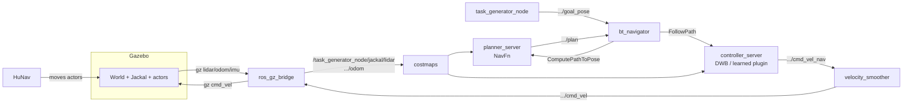

# 1. Mental model: what each piece does

## The one-sentence version

**Gazebo** simulates physics and sensors. **ROS 2** is the message bus that connects everything. **Nav2** turns "go to (x,y)" into velocity commands. **HuNav** moves the pedestrians. **RViz** only *displays* ROS data. **Arena** is the orchestrator: it launches all of the above, spawns robots, obstacles and people, hands out goals, detects when an episode ends, and resets.

| Component | Process(es) you'll see | Owns | Does NOT do |
|---|---|---|---|
| **Gazebo Harmonic** (`gz sim`) | `gz sim server`, `gz sim gui` | Physics, collisions, wheel dynamics, lidar/IMU simulation, 3D world | Any decision-making |
| **ros_gz_bridge** | `ros_gz_bridge` (one global, one per robot) | Translating Gazebo topics ↔ ROS topics (odom, lidar, cmd_vel, clock) | — |
| **ROS 2 Humble** | (a library, not a process) | Topics (streams), services (RPC), actions (long tasks with feedback), parameters, TF (coordinate frames) | — |
| **Nav2** | `controller_server`, `planner_server`, `bt_navigator`, `velocity_smoother`, `behavior_server`, costmaps, `amcl` | Global path planning, local control, recovery behaviours, costmaps, localization | Simulate anything |
| **HuNav** | `hunav_agent_manager` + a Gazebo system plugin | Pedestrian motion via the social force model | — |
| **Arena task_generator** | `task_generator_node` | Spawning robots/obstacles/people, goals, episode resets, launching each robot's Nav2 stack | Robot control |
| **RViz** | `rviz2` | Visualization + a few input tools (2D goal, initial pose), Arena's Task Generator panel | Execute policies |

> **Gazebo vs. RViz.** Gazebo shows what is *true* in the simulated world. RViz shows what the robot's software *believes*: estimated pose, costmaps, planned path. If they disagree, you've found a localization or TF bug.

## How one control cycle flows (verified on the live hospital sim)

All robot topics live under `/task_generator_node/<robot_name>/`, which is `/task_generator_node/jackal/` for the single Jackal.

Verified publisher chain from the live sim: `controller_server → cmd_vel_nav → velocity_smoother → cmd_vel → ros_gz_bridge → Gazebo`. `behavior_server` also publishes to `cmd_vel` during recoveries (spin, back-up).

## What happens when you run `ros2 launch arena_bringup arena.launch.py ...`

This matters when you're hunting for "where does X get configured?"

1. **`arena_bringup/launch/arena.launch.py`** declares the top-level args (`sim`, `world`, `robot`, `local_planner`, …) and starts three things:
   - **`sim.launch.py` → `gazebo.launch.py`**: stages models, sets `GZ_SIM_RESOURCE_PATH`, runs `gz sim <world>.world -r`, and starts the `/clock` bridge. If `worlds/<world>/worlds/<world>.world` doesn't exist, it silently falls back to `arena_bringup/configs/gazebo/empty.sdf`.
   - **`human.launch.py` → `hunav.launch.py`**: starts `hunav_agent_manager`.
   - **`task_generator.launch.py`**: starts `map_server` (serves the world's `map/map.yaml`), RViz and its config generator, the pedestrian marker publisher, and **`task_generator_node`**, which gets `arena_bringup/configs/task_generator.yaml` as parameters.
2. **`task_generator_node`** then does the rest *at runtime, from Python*:
   - Waits for the map, loads the world, and spawns world obstacles.
   - For each robot: spawns the URDF in Gazebo and starts a per-robot bridge using `entities/robots/<robot>/mappings.yaml`.
   - **Launches Nav2 for that robot** by calling `arena_simulation_setup/launch/robot.launch.py`, which calls `nav2.launch.py`, which merges the YAML configs (see [04](04-configuring-sim-and-robot.md#the-nav2-yaml-merge-chain)).
   - Builds the **task** from the task modes (`tm_robots`, `tm_obstacles`, `tm_modules`), calls `reset()`, and publishes the goal.
   - Every 0.5 s it checks `task.is_done`: goal reached, or timeout if one is set. When done, it resets and starts a new episode.

Code locations for the steps above:

| Step | File |
|---|---|
| Top-level launch | `~/arena_ws/src/arena/arena-rosnav/arena_bringup/launch/arena.launch.py` |
| Gazebo launch | `.../arena_bringup/launch/simulator/sim/gazebo/gazebo.launch.py` |
| Task generator main loop | `.../task_generator/task_generator/node.py` |
| Per-robot spawn + Nav2 launch | `.../task_generator/task_generator/manager/robot_manager/robot_manager.py` (`set_up_robot`, `_launch_robot`) |
| Nav2 config assembly | `~/arena_ws/src/arena/simulation-setup/launch/nav2.launch.py` |
| Task modes | `.../task_generator/task_generator/tasks/{robots,obstacles,modules}/` |

## Vocabulary you'll run into

- **World**: physical layout. A Gazebo `.world`/SDF file plus a 2D occupancy map (`map.yaml` + image) used by Nav2.
- **Scenario**: a JSON file in `worlds/<world>/scenarios/`: robot start/goal, extra static obstacles, and pedestrian starts and waypoints.
- **Task mode**: how the task generator picks starts, goals and obstacles each episode (`random`, `explore`, `scenario`, …).
- **Global planner** (NavFn, Smac, Theta*): plans a full path on the static map. Runs rarely.
- **Local planner / controller** (DWB, MPPI, RPP, or a learned policy): produces `cmd_vel` every control tick while following that path around nearby obstacles. **This is where crowd-navigation policies plug in.**
- **Inter planner** (Arena's term): the Nav2 **behaviour tree** XML that decides when to replan, recover, and so on.
- **Costmap**: 2D grid of "how bad is it to be here", built from the static map, lidar, and inflation.
- **TF**: the tree of coordinate frames (`map → jackal/odom → jackal/base_link → jackal/lidar_link`).
- **Lifecycle node**: Nav2 nodes go through `configure → activate`. A node stuck in `inactive` makes the whole stack look dead.
- **`use_sim_time`**: nodes use Gazebo's `/clock` rather than wall time. If the sim runs at 0.3× real time, everything is 0.3× too.
