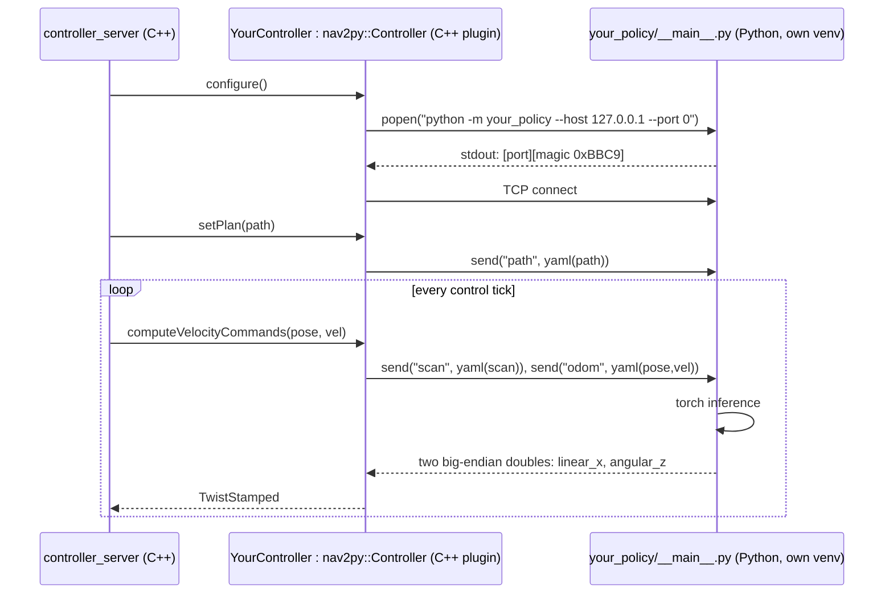

# 5. Policies: swapping, installing learned ones, and adding your own PyTorch model

## Where a "policy" lives in this stack

In Arena 5 / humble, a navigation policy is a **Nav2 controller plugin**. It's selected by `local_planner:=<name>`, which maps to `~/arena_ws/src/arena/simulation-setup/configs/nav2/controllers/<name>/controller_config.yaml`. That file names the plugin class:

```yaml
controller_plugins: [FollowPath]
controller_plugins_dict:
  FollowPath:
    plugin: "dwb_core::DWBLocalPlanner"     # ← the class Nav2 loads via pluginlib
    max_vel_x: 0.26                          # ← plugin-specific params
```

Nav2's `controller_server` then calls, for every control tick:
`computeVelocityCommands(current_pose, current_velocity, goal_checker) → Twist`,
with the global path given beforehand through `setPlan(path)`, and costmap access through the plugin's `configure()`.

So **"add a policy"** = get a class that implements `nav2_core::Controller` built and installed, plus a `controller_config.yaml` that names it.

## Inventory on this machine

| `local_planner:=` | Plugin | Kind | Installed? |
|---|---|---|---|
| `dwb` | `dwb_core::DWBLocalPlanner` | Classical (trajectory rollout + critics) | ✅ |
| `mppi` | `nav2_mppi_controller::MPPIController` | Classical (sampling MPC) | ✅ (part of Nav2) |
| `regulated_pure_pursuit` | RPP | Classical (path tracker, no dynamic avoidance) | ✅ |
| `rotation_shim` | Rotation shim wrapping RPP (rotates in place first, then tracks) | Classical wrapper | ✅ |
| `graceful` | `nav2_graceful_controller::GracefulController` | Classical | ✅ |
| `drlvo` | `nav2py_drl_vo_controller::DRL_VO_Controller` | **Learned** (DRL-VO, PPO) | ❌ needs planners install |
| `crowdnav` | `nav2py_pas_crowdnav_controller::PasCrowdNavController` | **Learned** (PaS CrowdNav) | ❌ |
| `crowdnav_attngraph` | `nav2py_crowdnav_attngraph_controller::TemplateController` | **Learned** (CrowdNav++ attention graph) | ❌ |
| `sicnav` | `nav2py_sicnav_controller::SicnavController` | Learned/MPC hybrid (SICNav) | ❌ |

Global planners (`global_planner:=`): `navfn`, `smac_2d`, `smac_hybrid`, `smac_state_lattice`, `theta_star`. All installed.

If you pick an uninstalled one, Nav2's `controller_server` fails to configure with a pluginlib "class does not exist" error, and the robot never moves.

### Try the classical ones first (zero install)

```bash
bash scripts/arena-launch.sh hospital scenario local_planner:=mppi
bash scripts/arena-launch.sh hospital scenario local_planner:=regulated_pure_pursuit
```

---

## Installing the learned planners (DRL-VO, CrowdNav, SICNav)

They come from `~/arena_ws/src/arena/arena-rosnav/.repos/planners.repos`:

| Repo → `src/planners/...` | What |
|---|---|
| `voshch/nav2py` | **The bridge library**: a C++ base class plus a Python base class (see below) |
| `voshch/ament_cmake_venv`, `ament_cmake_venv_uv` | CMake helpers that build a **per-planner Python venv with `uv`** |
| `Arena-Rosnav/nav2py_drlvo` | DRL-VO. Pins **Python 3.8.5, torch 1.7.1+cu110, stable-baselines3 1.1.0**. Weights are shipped in `model/drl_vo/`. |
| `zenghjian/Nav2_PaS_CrowdNav` | PaS CrowdNav |
| `hungwlor/crowdnav_arena` (branch nav2py) | CrowdNav++ attention graph |
| `SugerSenpai/nav2py_sicnav` | SICNav |

**Correction to the chat:** skipping `3_planners.sh` was fine for the DWB demo. But it *is* the gate for the learned policies. The script only installs `uv`, and that's exactly what these packages need, because each one builds an isolated Python with its own torch version. Once `planners.sh` is recorded in `.installed`, Arena's `pull` script also imports `planners.repos`.

Suggested procedure. **Save your local patches first**, see [02](02-workspace-and-build.md#updating-arena-careful):

```bash
cd ~/arena_ws && source arena.bash
# 1. uv (what 3_planners.sh does)
command -v uv || curl -LsSf https://astral.sh/uv/install.sh | sh
echo planners.sh >> src/arena/arena-rosnav/.installed

# 2. fetch planner sources only (avoids a full `pull` that touches patched repos)
vcs import --input src/arena/arena-rosnav/.repos/planners.repos --recursive src
rosdep install --from-paths src/planners --ignore-src -r -y --rosdistro humble

# 3. build the bridge first, then one planner at a time
colcon build --symlink-install --packages-up-to nav2py --cmake-args -DBUILD_TESTING=OFF
colcon build --symlink-install --packages-up-to nav2py_drl_vo_controller --cmake-args -DBUILD_TESTING=OFF
source install/local_setup.bash

# 4. run
bash ~/Documents/Lyu_Lab/initial-arena-testing/scripts/arena-launch.sh hospital scenario local_planner:=drlvo
```

Expect friction. Old pinned torch or CUDA wheels vs. the L4 GPU and Python 3.8 availability through `uv`. Package names in step 3 come from each repo's `package.xml`; check with `colcon list --base-paths src/planners`. Do one planner at a time and keep notes in this repo.

Each learned planner also has **observation assumptions**. DRL-VO, for example, expects a specific lidar layout plus pedestrian kinematics, and was trained on a particular robot and speed range. Read each planner's Python code for the exact inputs before comparing results. A policy fed the wrong lidar size will "work" and behave badly.

---

## How nav2py works (read from the source)



**Python side** (`nav2py.interfaces.nav2py_costmap_controller`):

```python
import nav2py, nav2py.interfaces, yaml, torch

class my_policy(nav2py.interfaces.nav2py_costmap_controller):
    def __init__(self, *a, **kw):
        super().__init__(*a, **kw)
        self.model = torch.jit.load("...") # or build nn.Module + load_state_dict
        self.model.eval()
        self._register_callback("path", self._on_path)
        self._register_callback("scan", self._on_scan)
        self._register_callback("odom", self._on_odom)   # the C++ side decides which names it sends

    def _on_path(self, msg):  self.path = yaml.safe_load(msg[0].decode())
    def _on_scan(self, msg):  self.scan = yaml.safe_load(msg[0].decode())
    def _on_odom(self, msg):
        d = yaml.safe_load(msg[0].decode())
        obs = self.build_observation(self.scan, d["pose"], d["velocity"], self.path)
        with torch.inference_mode():
            v, w = self.model(obs).tolist()
        self._send_cmd_vel(float(v), float(w))          # ← reply ends the C++ side's wait

if __name__ == "__main__":
    nav2py.main(my_policy)
```

**C++ side:** a small class deriving from `nav2py::Controller`. In `configure()` it calls `nav2py_bootstrap(<python cmd>)`. In `setPlan` / `computeVelocityCommands` it calls `nav2py_send("name", {yaml})` and reads the reply with `recv_double()`. Copy `nav2py_drl_vo_controller/src/drl_vo_controller.cpp` and rename. The C++ is boilerplate; your research lives in Python.

**Build side:** `CMakeLists.txt` uses `uv_venv(PROJECTFILE pyproject.toml)` and `nav2py_package(<name>)`. `pyproject.toml` lists your Python deps, e.g. torch. A `<name>.xml` pluginlib description exports the class.

### Recipe: adding your own PyTorch policy

1. Install the planners stack (above) so `nav2py` and `ament_cmake_venv_uv` exist.
2. `cp -r src/planners/Drl_vo/nav2py_drl_vo_controller src/planners/my_policy` (keep it in *your own git repo*, symlinked into `src/planners/`), then rename the package, class, namespace and plugin XML.
3. Replace the Python model code. Keep the callback and `_send_cmd_vel` contract.
4. Add `~/arena_ws/src/arena/simulation-setup/configs/nav2/controllers/my_policy/controller_config.yaml`:
   ```yaml
   controller_plugins: [FollowPath]
   controller_plugins_dict:
     FollowPath:
       plugin: "my_policy::MyPolicyController"
   ```
5. `colcon build --symlink-install --packages-select my_policy arena_simulation_setup`, then source.
6. `arena-launch.sh hospital scenario local_planner:=my_policy`.

### Alternative for quick prototyping: a plain rclpy node (no Nav2 plugin)

For a first experiment, before writing any C++, write a normal ROS 2 Python node. It subscribes to `/task_generator_node/jackal/lidar`, `.../odom` and `.../goal_pose` (or `.../plan`), runs torch, and publishes `geometry_msgs/Twist` to `/task_generator_node/jackal/cmd_vel`.

Caveats:
- Nav2 is still running and **also publishes `cmd_vel`** through the `velocity_smoother`. You must silence it: use `local_planner:=` a config whose controller outputs zero, or deactivate `controller_server` with `ros2 lifecycle set .../controller_server deactivate`. Otherwise publish to a different topic and remap.
- Arena's episode logic keys off Nav2's `navigate_to_pose` action status to detect "goal reached". Without Nav2 driving, you need `timeout` set or your own goal check plus a `reset_task` service call.
- Run it with the Arena venv Python after installing torch there (`poetry run pip install torch`), or with a separate venv that can import `rclpy`. It must be Python 3.10 to match ROS Humble's `rclpy`.

This path is great for understanding observation and action plumbing. The nav2py plugin path is better for fair benchmark comparisons, because it slots into exactly the same pipeline as DWB and the published learned planners.

---

## What about RL *training* (RosNav-RL)?

Current state on this install:
- `arena-rosnav/training/scripts/train_agent.py` imports **`rospy`** (ROS 1) and `rosnav`. It's legacy and **not runnable on humble**.
- `utils/rl_utils` contains observation collectors, reward units, and a *Flatland* gymnasium env. These are useful as reference for how Arena structures observations and rewards, but not wired to Gazebo here.
- `installers/x_training.sh` installs the poetry `training` group (torch ^1.11, wandb, SB3-era deps). It is not installed.
- `arena_bringup/configs/training/` holds reward-function and curriculum YAMLs from the ROS 1 era.
- The separate `Arena-Rosnav/rosnav-rl` project is the upstream home of the ROS 2 RL tooling. It isn't in any `.repos` file here, so integrating it is a project in itself.

**Recommendation:** start by *deploying* existing pretrained policies through nav2py and comparing them. Training in Gazebo with 17 pedestrians is slow, even on the L4. If you later train, do it in a lighter simulator or dedicated env (e.g. CrowdNav's gym), then deploy the weights into Arena through nav2py for evaluation.

---

## Comparing policies fairly: checklist

- [ ] Same robot, footprint, and **effective velocity/acceleration limits**. Controller config and velocity_smoother both count.
- [ ] Same `controller_frequency`. Fix the 1 Hz first, see [06](06-local-patches-and-gotchas.md).
- [ ] Each policy gets the observations it was trained on: lidar layout, pedestrian states or not.
- [ ] Same scenario file, pedestrian behaviour, HuNav per-agent behaviour/force settings (same scenario spec + seed), and physics step.
- [ ] Episode `timeout` set, `episodes` set, `record_data_dir:=<planner_name>` to record.
- [ ] Metrics: success / collision / timeout, time-to-goal, path length, min distance to pedestrians, jerk. `arena_evaluation` computes most of these (`get_metrics.py`, `create_plots.py`).
- [ ] Several runs per policy. Reactive pedestrians plus physics timing make runs non-deterministic.
